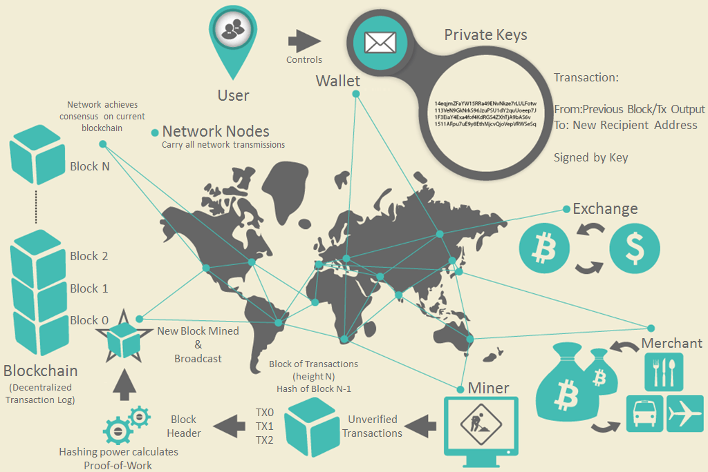

# Introduction

_martin@57blocks.com_

An introduction to the basics of blockchain.

## What is blockchain?

We see that the blockchain system consists of users with wallets containing keys, transactions that are propagated across the network, and miners who produce (through competitive computation) the consensus blockchain, which is the authoritative ledger of all transactions.

A blockchain is a distributed ledger with growing lists of records (blocks) that are securely linked together via cryptographic hashes. Each block contains a cryptographic hash of the previous block, a timestamp, and transaction data (generally represented as a Merkle tree, where data nodes are represented by leaves). The timestamp proves that the transaction data existed when the block was created. Since each block contains information about the previous block, they effectively form a chain (compare linked list data structure), with each additional block linking to the ones before it. Consequently, blockchain transactions are irreversible in that, once they are recorded, the data in any given block cannot be altered retroactively without altering all subsequent blocks.

## Category

### Public Blockchain

A public blockchain has absolutely no access restrictions. Anyone with an Internet connection can send transactions to it as well as become a validator (i.e., participate in the execution of a consensus protocol). Usually, such networks offer economic incentives for those who secure them and utilize some type of a Proof of Stake or Proof of Work algorithm.

Some of the largest, most known public blockchains are the bitcoin blockchain and the Ethereum blockchain.

- [Bitcoin](https://bitcoin.org/en/)

- [Ethereum](https://ethereum.org/en/what-is-ethereum/)

### Consortium Blockchain

A consortium blockchain is a type of blockchain that combines elements of both public and private blockchains. In a consortium blockchain, a group of organizations come together to create and operate the blockchain, rather than a single entity. The consortium members jointly manage the blockchain network and are responsible for validating transactions. Consortium blockchains are permissioned, meaning that only certain individuals or organizations are allowed to participate in the network. This allows for greater control over who can access the blockchain and helps to ensure that sensitive information is kept confidential.

Consortium blockchains are commonly used in industries where multiple organizations need to collaborate on a common goal, such as supply chain management or financial services. One advantage of consortium blockchains is that they can be more efficient and scalable than public blockchains, as the number of nodes required to validate transactions is typically smaller. Additionally, consortium blockchains can provide greater security and reliability than private blockchains, as the consortium members work together to maintain the network. Some examples of consortium blockchains include Quorum and Hyperledger.

- [Hyperledger Fabric](https://www.hyperledger.org/use/fabric)
- [Ethereum quorum](https://consensys.net/quorum/)

### Private Blockchain

A private blockchain is permissioned. One cannot join it unless invited by the network administrators. Participant and validator access is restricted. To distinguish between open blockchains and other peer-to-peer decentralized database applications that are not open ad-hoc compute clusters, the terminology Distributed Ledger (DLT) is normally used for private blockchains.

## Comparison

| Property                                   | Public                                            | Consortium                              | Private                                       |
| :----------------------------------------- | :------------------------------------------------ | :-------------------------------------- | :-------------------------------------------- |
| **Usability**                              | Currency, Document validations and IoT operations | Finance, supply chain and research work | Supply chain, real estate and asset ownership |
| **Performance**                            | Low                                               | High                                    | Very High                                     |
| **Decentralization**                       | Public                                            | Permissioned                            | Permissioned                                  |
| **Transparency / Auditability / Security** | Lack of security                                  | Lack of transparency                    | Lack of auditability                          |
| **Scalability**                            | Bad                                               | Good                                    | Good                                          |

## Glossary

- [Binance](https://academy.binance.com/en/glossary)
- [Coingecko](https://www.coingecko.com/en/glossary)

## References

[Mastering Bitcoin](https://github.com/bitcoinbook/bitcoinbook)
