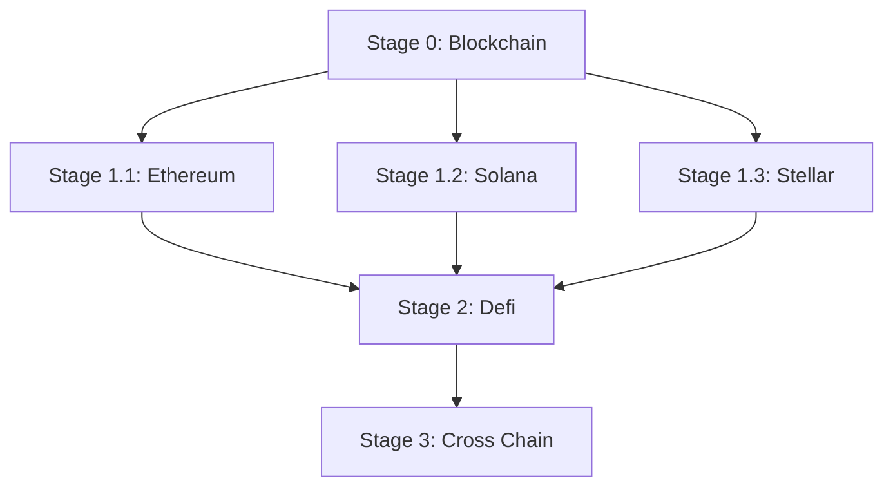

# Beginner

This guide is the beginner entry point for Blockchain foundations. It curates a small set of high-quality articles, books, and videos to help you build the mental model behind wallets, transactions, blocks, and consensus before diving into ecosystem-specific modules (e.g., Ethereum, Solana).

## Learning Path

- Stage 0: Start here (Blockchain foundations) — use the resources on this page.
- Stage 1.1: Ethereum — [Beginner](../../ethereum/beginner/README.md)
- Stage 1.2: Solana — [Beginner](../../solana/beginner/README.md)
- Stage 1.3: Stellar — [Beginner](../../stellar/beginner/README.md)
- Stage 2: Defi — [Beginner](../../defi/guide/README.md)
- Stage 3: Cross Chain — [Beginner](../../cross-chain/guide/README.md)

## Recommended Articles

- Overview
  - [What is Web3?](https://ethereum.org/web3/) - High-level overview of Web3: user ownership, decentralization, and common applications.
  - [Blockchain Facts](https://www.investopedia.com/terms/b/blockchain.asp) - Beginner-friendly definition, how blockchains work, and where they’re used.
  - [Why is blockchain important?](https://www.simplilearn.com/tutorials/blockchain-tutorial/why-is-blockchain-important) - Overview of why blockchains matter, focusing on transparency, security, and efficiency.
  - [Benefits of blockchain](https://www.ibm.com/think/topics/benefits-of-blockchain) - Practical benefits and common use cases, with an enterprise perspective.
  - [The Meaning of Decentralization](https://medium.com/@VitalikButerin/the-meaning-of-decentralization-a0c92b76a274) - Framework for thinking about decentralization beyond slogans, with trade-offs and dimensions.
- Blockchain Basics
  - [Learn the basics of Distributed Ledger Technology](https://developer.ibm.com/tutorials/cl-blockchain-basics-intro-bluemix-trs/) (DLT) - High-level overview of ledgers, blocks, consensus, and common enterprise use cases.
  - [Bitcoin protocol Explained](https://medium.com/coinmonks/bitcoin-white-paper-explained-part-1-4-16cba783146a) - Guided walkthrough of the Bitcoin whitepaper concepts and why they work together.
  - [Elliptic Curve Cryptography](https://medium.com/coinmonks/learn-how-to-code-elliptic-curve-cryptography-a952dfdc20ab) - Practical intro to ECC and how it underpins blockchain keypairs and signatures.
  - [Proof of Work](https://ethereum.org/en/developers/docs/consensus-mechanisms/pow/) - What PoW is, how mining secures the chain, and trade-offs like cost and latency.
  - [Proof of Stake](https://ethereum.org/en/developers/docs/consensus-mechanisms/pos/) - How validators, staking, and rewards/penalties work at a conceptual level.
  - [Delegated Proof of Stake](https://academy.binance.com/en/articles/delegated-proof-of-stake-explained) - DPoS explained: token-holder voting, validator sets, and performance vs decentralization trade-offs.
  - [Practical Byzantine Fault Tolerance](https://blockonomi.com/practical-byzantine-fault-tolerance/) - PBFT overview: quorum voting, phases, and why it’s popular in permissioned settings.
- Encryption knowledge
  - [Basic concepts](https://www.geeksforgeeks.org/digital-signatures-certificates/) - Intro to asymmetric cryptography, digital signatures, and certificates.
  - [Digital signature extension](https://www.iacr.org/archive/pkc2003/25670031/25670031.pdf) - Survey of advanced signature schemes (multi/blind/group/ring signatures).
  - [Merkle tree](https://www.geeksforgeeks.org/introduction-to-merkle-tree/) - Hash-tree structure for efficient integrity proofs and membership verification.

## Recommended Books

- [Mastering Bitcoin](https://github.com/bitcoinbook/bitcoinbook) - A practical, developer-oriented introduction to Bitcoin and blockchain fundamentals.

## Recommended Videos

- [Blockchain - A visual demo](https://www.youtube.com/watch?v=bBC-nXj3Ng4) - This is a very basic visual introduction to the concepts behind a blockchain.
- [But how does bitcoin actually work?](https://www.youtube.com/watch?v=_160oMzblY8) - This video succinctly explains the intricacies of Bitcoin's decentralized operation, blockchain foundation, mining process, and its role in finance.
