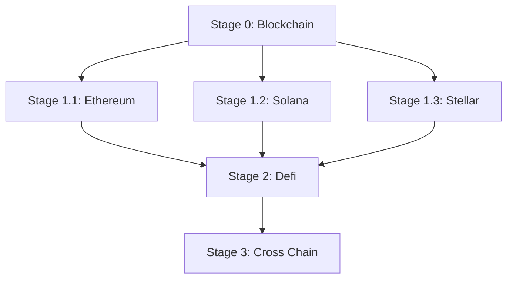

# Beginner

This guide is the beginner entry point for Blockchain foundations. It curates a small set of high-quality articles, books, and videos to help you build the mental model behind wallets, transactions, blocks, and consensus before diving into ecosystem-specific modules (e.g., Ethereum, Solana).

> Legend: ★ marks the most recommended resources.

## Learning Path

- Stage 0: Start here (Blockchain foundations) — use the resources on this page.
- Stage 1.1: Ethereum — [Beginner](../../chains/ethereum/beginner/README.md)
- Stage 1.2: Solana — [Beginner](../../chains/solana/beginner/README.md)
- Stage 1.3: Stellar — [Beginner](../../chains/stellar/beginner/README.md)
- Stage 2: Defi — [Beginner](../../defi/beginner/README.md)
- Stage 3: Cross Chain — [Beginner](../../cross-chain/beginner/README.md)

## Recommended Articles

- Overview
  - [★What is Web3? ](https://ethereum.org/web3/) - High-level overview of Web3: user ownership, decentralization, and common applications.
- Blockchain Basics
  - [★Why is blockchain important?](https://www.simplilearn.com/tutorials/blockchain-tutorial/why-is-blockchain-important) - Overview of why blockchains matter, focusing on transparency, security, and efficiency.
  - [Bitcoin protocol Explained](https://medium.com/coinmonks/bitcoin-white-paper-explained-part-1-4-16cba783146a) - Guided walkthrough of the Bitcoin whitepaper concepts and why they work together.

## Recommended Books

- [★Mastering Bitcoin](https://github.com/bitcoinbook/bitcoinbook) - A practical, developer-oriented introduction to Bitcoin and blockchain fundamentals.

## Recommended Videos

- [★Blockchain - A visual demo](https://www.youtube.com/watch?v=bBC-nXj3Ng4) - This is a very basic visual introduction to the concepts behind a blockchain.
- [But how does bitcoin actually work?](https://www.youtube.com/watch?v=_160oMzblY8) - This video succinctly explains the intricacies of Bitcoin's decentralized operation, blockchain foundation, mining process, and its role in finance.
