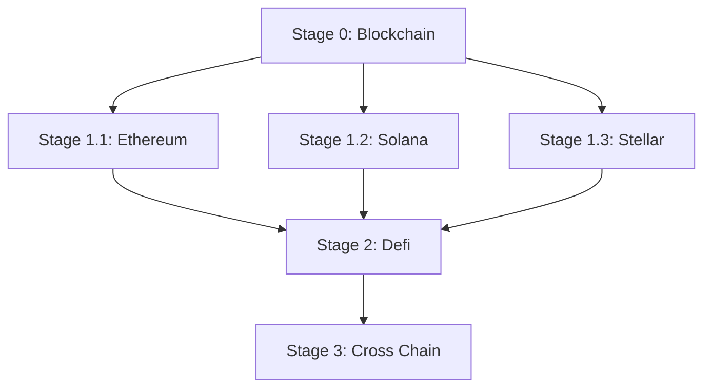

# Beginner

This guide is the beginner entry point for Blockchain foundations. It curates a small set of high-quality articles, books, and videos to help you build the mental model behind wallets, transactions, blocks, and consensus before diving into ecosystem-specific modules (e.g., Ethereum, Solana).

> Legend: ★ marks the most recommended resources.

## Learning Path

Milestones:

- Complete wallet backup and anti-phishing checks on a test wallet.
- Complete one testnet transaction and explain fee fields in your own words.
- Verify the same transaction in an explorer and explain the final status.

Stage notes:

- Stage 0: Start here (Blockchain foundations) — use the resources on this page.
- Stage 1.1: Ethereum — [Beginner](../../chains/ethereum/beginner/README.md)
- Stage 1.2: Solana — [Beginner](../../chains/solana/beginner/README.md)
- Stage 1.3: Stellar — [Beginner](../../chains/stellar/beginner/README.md)
- Stage 2: Defi — [Beginner](../../defi/beginner/README.md)
- Stage 3: Cross Chain — [Beginner](../../cross-chain/beginner/README.md)

## Minimal Must-Learn Path

Recommended MVP duration: 1 week.
If a resource is long, complete only the required part listed in each step.

1. Articles (Day 1): read [★What is Web3?](https://ethereum.org/web3/) and [Why is blockchain important?](https://www.simplilearn.com/tutorials/blockchain-tutorial/why-is-blockchain-important). Required outcome: explain why blockchain exists and what problem it solves.
2. Article deep dive (Day 2): study [Bitcoin protocol Explained](https://medium.com/coinmonks/bitcoin-white-paper-explained-part-1-4-16cba783146a). Required outcome: explain block, transaction, mining, and consensus at a high level.
3. Book (Day 3-4): read selected parts of [★Mastering Bitcoin](https://github.com/bitcoinbook/bitcoinbook). Required part: introductory chapters about keys/wallets, transactions, and blocks.
4. Videos (Day 5-6): watch [★Blockchain - A visual demo](https://www.youtube.com/watch?v=bBC-nXj3Ng4) and [But how does bitcoin actually work?](https://www.youtube.com/watch?v=_160oMzblY8). Required outcome: connect visual intuition with the protocol concepts you read.
5. Consolidation (Day 7): revisit the same resources and create a one-page summary of wallet, transaction lifecycle, and finality concepts. Required outcome: complete the page milestones (testnet tx + explorer verification + fee explanation).

## Recommended Articles

- [★What is Web3?](https://ethereum.org/web3/) - High-level overview of Web3.
- [Why is blockchain important?](https://www.simplilearn.com/tutorials/blockchain-tutorial/why-is-blockchain-important) - Intro to why blockchain matters.
- [Bitcoin protocol Explained](https://medium.com/coinmonks/bitcoin-white-paper-explained-part-1-4-16cba783146a) - Walkthrough of Bitcoin whitepaper concepts.

## Recommended Books

- [★Mastering Bitcoin](https://github.com/bitcoinbook/bitcoinbook) - A practical, developer-oriented introduction to Bitcoin and blockchain fundamentals.

## Recommended Videos

- [★Blockchain - A visual demo](https://www.youtube.com/watch?v=bBC-nXj3Ng4) - This is a very basic visual introduction to the concepts behind a blockchain.
- [But how does bitcoin actually work?](https://www.youtube.com/watch?v=_160oMzblY8) - This video succinctly explains the intricacies of Bitcoin's decentralized operation, blockchain foundation, mining process, and its role in finance.
