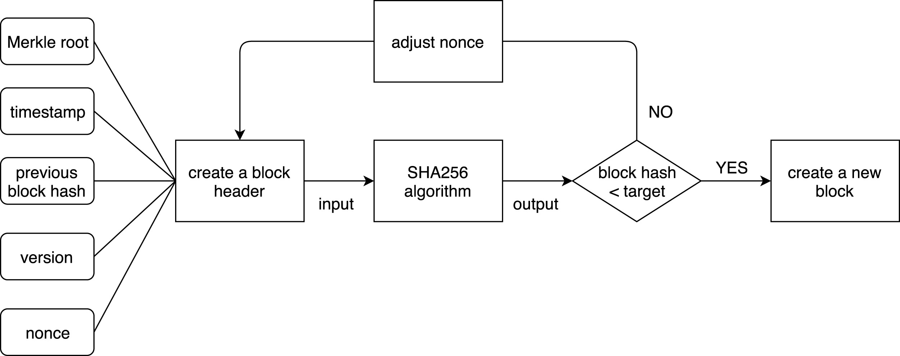
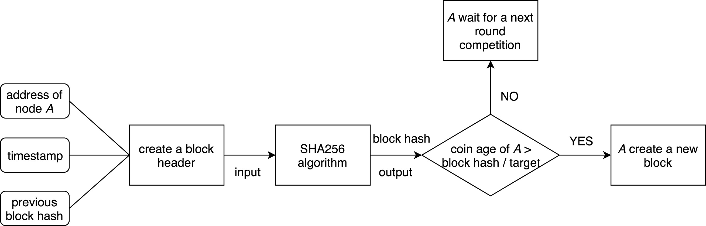
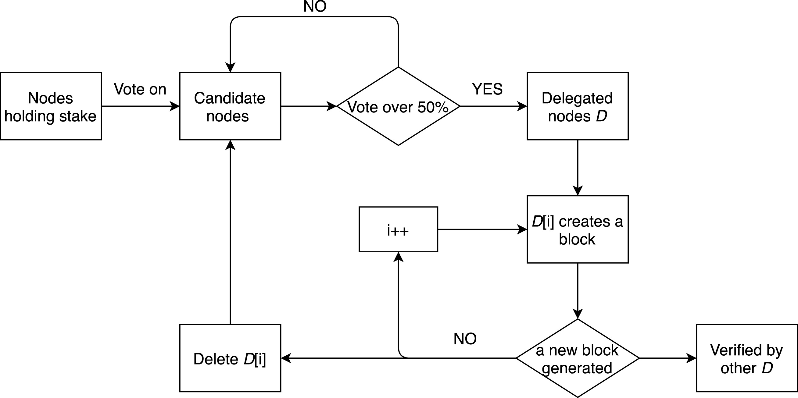
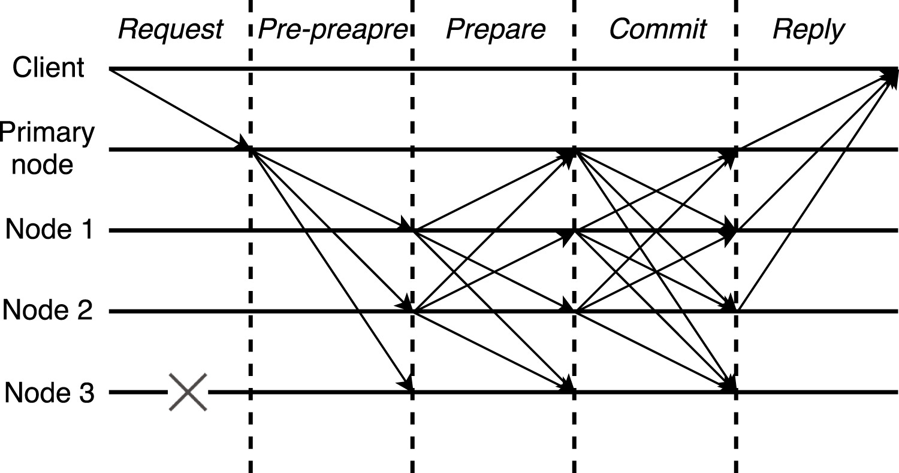
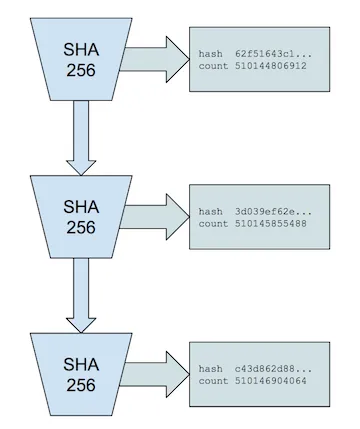

# Consensus

_martin@57blocks.com_

An introduction to the consensus mechanism of blockchain.

## What is consensus？

Blockchain consensus is the process by which all participants in a blockchain network reach agreement on the current state of the network. This agreement is critical for ensuring the security and integrity of the blockchain, as it ensures that all participants have a consistent view of the network and that transactions are properly validated and processed.

The role of consensus mechanisms in a blockchain network is to establish trust among participants and to ensure that all participants agree on the current state of the network. The consensus mechanism determines how transactions are validated, how new blocks are added to the chain, and how the network reaches agreement on the current state of the network.

There are several consensus mechanisms used in different blockchain networks, including Proof-of-Work (PoW), Proof-of-Stake (PoS), Delegated Proof-of-Stake (DPoS), and Practical Byzantine Fault Tolerance (PBFT). Each of these consensus mechanisms has its own strengths and weaknesses and is suited to different use cases and network requirements.

In general, the consensus mechanism is a crucial component of any blockchain network, as it determines the security, efficiency, and decentralization of the network. A well-designed consensus mechanism is essential for ensuring the long-term success and viability of the network, and choosing the right consensus mechanism is an important decision for any blockchain project.

## Category

### PoW

In PoW (Proof of Work), a node is selected through the competition of computing power, and the node determines the block content (bookkeeping right) of the next round of consensus. PoW requires nodes to consume their own computing power to try different random numbers (nonce), so as to find hash values that meet the requirements of computing power difficulty, and repeatedly try different nonces until they meet the requirements. This process is called "mining".

The first node to find a suitable nonce gets the bookkeeping right. After the node generates a new block, it broadcasts it to other nodes, and other nodes verify the block. If it passes the verification, it accepts the block and completes the current round of consensus. Otherwise, it rejects the block and continues to search for a suitable nonce.

Finding a nonce that meets the requirements is very difficult and requires nodes to consume a lot of computing power. With the continuous accumulation of valid blocks, malicious nodes need to consume a huge amount of computing power to overthrow the previous blocks and complete the double-spending attack.

Please read [Mining and Consensus](https://github.com/bitcoinbook/bitcoinbook/blob/develop/ch10.asciidoc) to learn the PoW consensus details.

### PoS

In the PoS consensus, nodes compete for accounting rights not by computing power but by rights (tokens). PoS also needs to calculate the hash value, but unlike PoW, it does not require continuous violent calculation to find the nonce value.

Each node only needs to calculate Hash once in each round of consensus. The more rights and interests it has, the greater the chance of meeting the Hash target and the greater the chance of obtaining bookkeeping rights. PoS is a resource-saving consensus protocol. The rights and interests defined by PeerCoin are not only related to the number of tokens, but also the coin age (Coin Age) is introduced. 100 tokens are held for two days, and the coin age is 200. The greater the chance of account rights.

Please read [Proof of stake](https://ethereum.org/en/developers/docs/consensus-mechanisms/pos/) to learn more.

### DPoS

Delegated Proof-of-Stake (DPoS) aims to address some of the scalability, security, and decentralization issues associated with PoW and PoS while providing a more efficient way to reach consensus on the network.

In DPoS, network participants elect a set of delegates or validators who are responsible for validating transactions and adding new blocks to the chain. The delegates are elected by the network's token holders through a voting process, and their role is to validate transactions and produce blocks on behalf of the network.

The process of selecting delegates is designed to balance the needs for decentralization and efficiency. Delegates are elected based on the number of votes they receive from the network's token holders, and the number of delegates is kept small to ensure high processing speeds.

Several nodes with the most votes from holders become the block producing nodes, represented by EOS, there are 21 nodes. In each round of consensus, a block producing node is selected in turn to generate a block and broadcast to other block producing nodes for verification. If the node fails to complete the block generation within the specified time, or generates an invalid block, it will be disqualified and replaced by re-voting to select a new block generation node.

Please read [DPoS Consensus Algorithm - The Missing White Paper](https://steemit.com/dpos/@dantheman/dpos-consensus-algorithm-this-missing-white-paper) to learn more.

### PBFT

PBFT is a Byzantine Fault Tolerance protocol with low algorithm complexity and high practicality in distributed systems. PBFT is mainly used in consortium blockchains. PBFT contains five phases: request, pre-prepare, prepare, commit and reply. The primary node forwards the message sent by the client to the other three nodes. In the case that node 3 is crashed, one message goes through five phases to reach a consensus among these nodes. Finally, these nodes reply to the client to complete a round of consensus. PBFT guarantees nodes maintain a common state and take a consistent action in each round of consensus. PBFT achieves the goal of strong consistency, thus it is an absolute-finality consensus protocol. As mentioned before, EOS takes a combined consensus protocol.

Please read [Practical Byzantine Fault Tolerance](https://pmg.csail.mit.edu/papers/osdi99.pdf) to learn more.

### PoH

Keeping track of the order of transactions is vital for cryptocurrencies. Bitcoin does this by bundling transactions into blocks with a single timestamp. Each node has to validate these blocks in consensus with other nodes. However, this process results in significant waiting time for nodes to confirm a block across the network. Solana takes a different approach called Proof of History (PoH).

Solana events and transactions are all hashed using the SHA256 hash function, which takes an input and produces a unique and extremely difficult to predict output. Solana takes the output of a transaction and uses it as input for the next hash, so the order of the transactions is now inbuilt into the hashed output.

This hashing process creates a long, unbroken chain of hashed transactions. This results in a clear, verifiable order of transactions that a validator can add to a block without the need for a conventional timestamp.

Hashing also requires a certain amount of time to complete, meaning validators can easily verify how much time has passed. By ordering transactions in a chain of hashes, validators process and transmit less information per block. Using a hashed version of the latest state of transactions greatly reduces block confirmation time.

PoH is not a consensus mechanism but instead, a way of shortening the time spent confirming the order of transactions. When combined with PoS, selecting the next validator for a block is much easier. Nodes need less time to validate the order of transactions, meaning the network chooses a new validator more quickly.

Please read [Proof of History: A Clock for Blockchain](https://medium.com/solana-labs/proof-of-history-a-clock-for-blockchain-cf47a61a9274) to learn more.

## Comparison

| Property          | PoW                    | PoS                    | DPoS                   | PBFT              |
| :---------------- | :--------------------- | :--------------------- | :--------------------- | :---------------- |
| Type              | Probabilistic-finality | Probabilistic-finality | Probabilistic-finality | Absolute-finality |
| Fault tolerance   | 50%                    | 50%                    | 50%                    | 33%               |
| Power consumption | Large                  | Less                   | Less                   | Negligible        |
| Scalability       | Good                   | Good                   | Good                   | Bad               |
| Application       | Public                 | Public                 | Public                 | Permissioned      |

Please read [Analysis of the main consensus protocols of blockchain](https://www.sciencedirect.com/science/article/pii/S240595951930164X) to learn the details.

## References

[Analysis of the main consensus protocols of blockchain](https://www.sciencedirect.com/science/article/pii/S240595951930164X)

[Proof of History: A Clock for Blockchain](https://medium.com/solana-labs/proof-of-history-a-clock-for-blockchain-cf47a61a9274)

[What is solana](https://academy.binance.com/en/articles/what-is-solana-sol)
