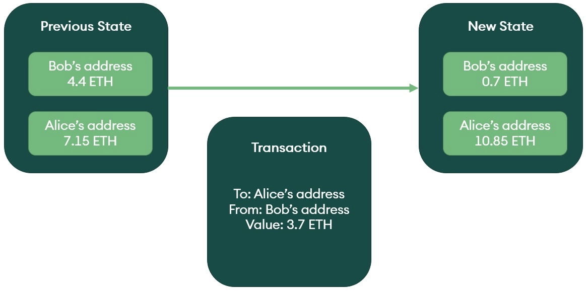

# Account Model

_victor@57blocks.com_

The account-based transaction model represents assets as balances within accounts, similar to bank accounts.
A transaction in the account-based model triggers nodes to decrement the balance of the sender's account and increment the balance of the receiver's account.
Ethereum uses this transaction model. See more detail of ethereum transaction, please refer to: [Ethereum Transaction](../../ethereum/concepts/transaction.md)

## How an ACCOUNT transaction works

The account model keeps track of all balances as a global state. This state can be understood as a database of all accounts, private keys, and contract-code controlled along with their current balances of the different assets on the network. Transactions are interpreted by the virtual machine in the network, and make the corresponding state changes to all accounts in the global state.

To better understand how an UTXO transaction been constructed, imagine Bob wants to pay 3.7 ETH to Alice:

1.  Check if Bob has enough ETH balance (4.4 ETH) to cover the payment (3.7 ETH).

2.  Send 3.7 ETH from Bob to Alice.

3.  Bob's ETH balance subtract payment amount, and set to 4.4 - 3.7 = 0.7 ETH.

4.  Alice's ETH balance add payment amount, and set to 7.15 + 3.7 = 10.85 ETH.

## Transaction fees

They are calculated based on the number of computations required to complete the state transition. Ethereum set out to be a world computer. Hence they decided that fees should be based on the number of computational resources consumed rather than storage capacity taken.

## Replay attack & Nonce

A replay attack is when a payee broadcasts a fraudulent transaction in which they get paid a second time. If the fraudulent transaction were to be successful, the transaction would be executed a second time - it is replayed - and the sender would be charged twice the amount they wanted to transfer.

To prevent replay attacks, each transaction in the account model has a nonce attached. A replay attack is when a payee broadcasts a fraudulent transaction in which they get paid a second time. If the fraudulent transaction were to be successful, the transaction would be executed a second time - it is replayed - and the sender would be charged twice the amount they wanted to transfer.

To combat this behavior, each account in Ethereum has a public viewable nonce that is incremented by one with each outgoing transaction. This prevents the same transaction being submitted to the network more than once.

## References

[Comparing the UTXO and Account Model](https://www.horizen.io/academy/utxo-vs-account-model/#comparing-the-utxo-and-account-model)

[TRANSACTIONS](https://ethereum.org/en/developers/docs/transactions/)

[Ethereum Whitepaper](https://ethereum.org/en/whitepaper/#ethereum-whitepaper)
