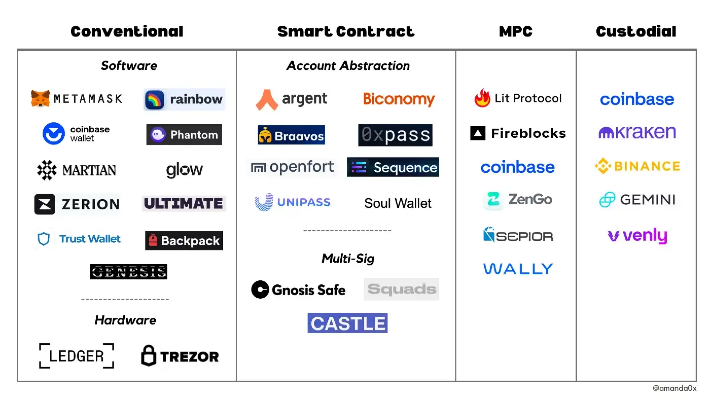
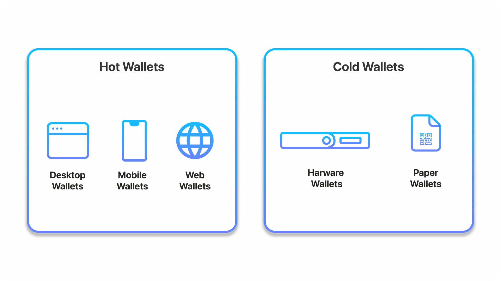
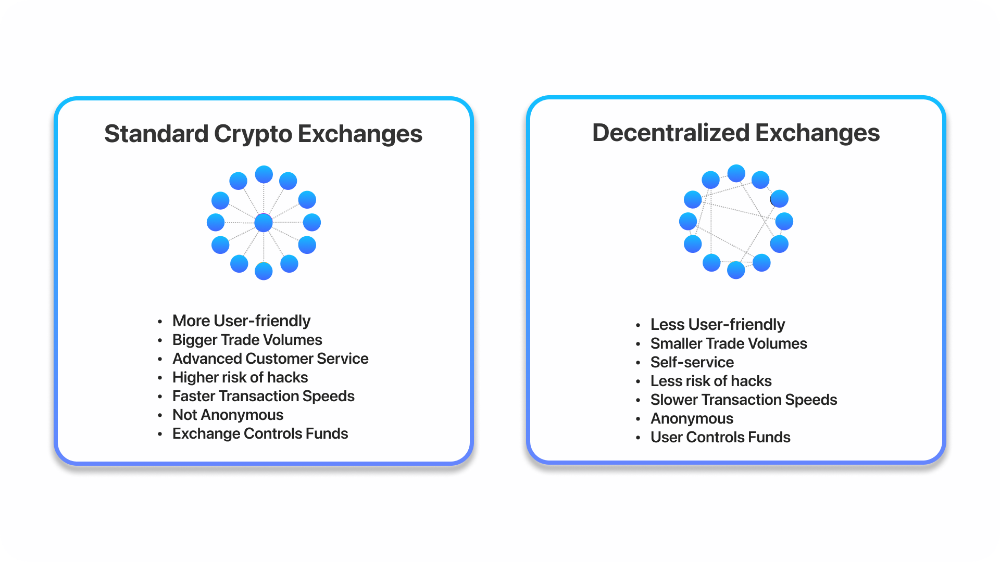

# Types Of Web3 Wallets 

*shu@57blocks.com*

This document describes the different types of web3 wallets and gives you a glimpse into web3 wallets.

## Intro to Web3 Wallets

Just like how people have a physical wallet to store paper money, these wallets help store access to your digital currency instead. In addition, Web3 wallets are capable of storing digital assets such as NFTs and enable users to interact with Decentralized Apps (dApps). This is done all without the necessity of a middleman involved.

Wallets don’t actually store the cryptocurrency, but they store the information required for access to your funds which are digital cryptocurrencies.

A crypto wallet has three main components:

* Public Key: This links to an address where you can send and receive transactions.

* Private Key: Must be kept secret and undisclosed. This is used for signing new transactions and enables access to funds.

* Seed Phrase: Used to generate multiple private keys. Act as a root key, giving access to the rest of the keys and addresses in a user’s wallet. This can also create new private keys.

In Web3, several types of wallets exist within the space. Each has its favorable use cases and may be useful depending on your intention of managing your data and funds. It’s ideal to try and see which type of wallet works best for you.

## How do web3 wallets work?

When a user creates a web3 wallet, they are given a unique private key that is used to prove ownership of their digital assets. This private key is then used to generate a corresponding public key, which can be used to verify the authenticity of transactions. By using these keys together, a web3 wallet can enable digital identity and prove ownership of digital assets in a secure and decentralized way.

Web3 wallets also enable digital identity by providing users with a unique address, also known as a "public address", that can be used to receive digital assets. This address is derived from the public key and can be shared publicly, allowing others to send digital assets to the user's wallet. By providing a unique public address, a web3 wallet can enable digital identity and prove ownership of digital assets in a secure and decentralized way.

This public address can also be tied to a decentralized name service — making it easier for others to remember and interact with your wallet’s public key. For the Ethereum blockchain, for example, you can register an .eth domain to your wallet through the [Ethereum Name Service (ENS)](https://ens.domains/?ref=thirdweb). In this way, someone is able to send a digital asset to your wallet by “addressing” it to your .eth domain, rather than your public key — which is a string of randomized numbers and letters.

## What are the different types of web3 wallets?

Web3 wallets are not all built the same, and nowadays, there are more options than ever for users to access and interact with the blockchain depending on their needs.

To understand this further, let’s look at the different types of web3 wallets, what their use cases are, and why they’re important:

### Hot Wallets vs. Cold Wallets

#### Hot Wallets

Hot Wallets are generally referred to as software wallets because they are hosted on devices that have access to the internet and cryptocurrency network. They are more convenient than other types of wallets due to their ability to store, send, receive, and view tokens. Hot wallets are considered the highest in utility when it comes to Web3 wallets.

Since hot wallets are connected to the web, they’re open to more hacks compared to cold wallets.

##### Desktop Wallets

Desktop wallets simply are downloaded as an application to our laptop or desktop. That means it is executed locally in the machine. They are considered the safest type of hot wallets available.

##### Web Wallets

Web wallets are installed on someone else’s computer or server. It allows people to interact via a browser interface. Therefore, it isn’t necessary to download or install anything on a device.

##### Mobile Wallets

These are very similar and work much like desktop wallets, except are designed specifically as mobile apps for smartphones.

#### Cold Wallets

Cold wallets tend to be a safer alternative to store cryptocurrencies because of no connection to the internet. This is because there is a physical medium to store the keys offline. This method makes cold wallets increasingly resistant to hackers, which is known as cold storage. This is specifically useful for long-term investors.

##### Hardware Wallets

Hardware wallets are physical electronic devices (often resembling a USB device) that use a Random number generator (RNG) to generate public and private keys. This is considered one of the safest alternatives because of its ability to hold public and private keys in the device without any connection to the internet. Therefore, access to your cryptocurrencies will be offline. Using hardware wallets for cold storage enables users to have more security and prevents hackers from accessing their funds.

As such, hardware wallets are most suitable for long-term investing and storage because they tend to be less accessible. Its main use case is for ensuring a high amount of security for large sums of money not allocated for constant usage.

##### Paper Wallets

A paper wallet is a piece of paper consisting of which a blockchain address and private key are physically printed out. These keys are printed out as QR codes. People can send funds by scanning QR codes.

### Web3 Wallets on Centralized Exchange (CEX) vs. Decentralized Exchange (DEX)

Centralized and decentralized exchanges have operated in parallel and occupy an important role throughout digital currencies. Although Decentralized Exchanges have not had their popularity until recently, they have played an increasing role today. With the rise of Defi enabling a new breed of financial products, it’s crucial to know how wallets play a role within the ecosystem.

#### Standard Crypto Exchanges

Within an exchange, your wallet is likely to be a hot wallet and custodial for facilitating faster trades. A benefit is that it’s easier to access and trade seamlessly with the traditional username and password configuration. You also have the option to withdraw crypto using your exchange-hosted private keys.

However, that also means relying your assets on a centralized entity as they have control over your private keys. More reputable crypto exchanges store the majority of funds outside of transactions in cold hardware wallets to ensure these funds are secured and offline. Some exchanges go beyond and insure potential losses against hacks.

#### Decentralized Exchanges

Decentralized exchanges enable non-custodial wallets to be used. This allows the user to maintain full custody of your private keys and funds. Many people are shifting to a non-custodial wallet because it eliminates the need for a third-party intermediary. Being non-custodial mean that there are no limits or restrictions set by fees, withdrawals, and more.

### Smart Contract and Multi-Sig Wallets
#### Smart Contract Wallets

Most conventional web3 wallets are Externally Owned Accounts (EOAs), meaning they are controlled by a private key (which you can think of as a password). Smart contract wallets, on the other hand, are built on top of smart contracts, which enables security functionality that EOA wallets do not have. This is made possible by a concept called [account abstraction](https://www.argent.xyz/blog/wtf-is-account-abstraction/?ref=thirdweb).

If a wallet is controlled by a smart contract, then it is programmed by that smart contract’s code. This makes it possible to program features into the wallet like social recovery, transfer limits, and account freezing for added usability and security.

One specific category of wallet that is enabled by smart contract wallets, and is growing in popularity, is multi-sig wallets — which are worth expanding on further as they have various use cases for companies and organizations, when more security is important.

#### Multi-Sig (aka Multi-Signature) Wallets

Multisig wallets are smart contract wallets that require more than one signature to authorize a transaction, enabling added security for the funds or assets stored within a wallet. Multisig wallets are managed by trusted third parties — like friends, family, or coworkers — that need to approve a transaction for it to go through.

This makes it harder for a bad actor to hack the assets in your wallet, since they would need to have access to each party’s wallet address (or the majority, if the multisig wallet requires a majority amount of signatures).

Pros include an added layer of security, but cons include the need for multiple parties to sign off on transactions, which can slow down the process.

#### Examples

[Argent - account abstraction](https://www.argent.xyz)

[Safe (fka Gnosis Safe) - multisig](https://safe.global)

### MPC Wallets

Multi-Party Computation, or MPC, allows two or more parties to compute without revealing any private information to one another.

In web3, MPC wallets replace a wallet’s private key with multiple, independently-created “secret shares.” This allows a safe self-custodial option for users since you do not need to worry about losing your private key or seed phrase.

### Email Wallets

Email wallets are a subsection of custodial wallets, and they have gained significant traction recently due to the frictionless user onboarding and adoption that they enable for web3 products.

Email wallets allow users to sign up for, log into, and create web3 wallets using their email addresses — making it very easy for users to use blockchain-based apps without any prior crypto experience. Because of this, many companies opt for custodial email wallets, taking care of security and the blockchain complexity for users that are unfamiliar with, or do not have, a traditional web3 wallet.

### References

[The 15 Best Web3 Wallets for 2022](https://www.alchemy.com/web3-wallets-overview#web3-1)

[The Complete Guide to Web3 Wallets](https://blog.thirdweb.com/web3-wallet/)

[EIP-4337](https://eips.ethereum.org/EIPS/eip-4337)