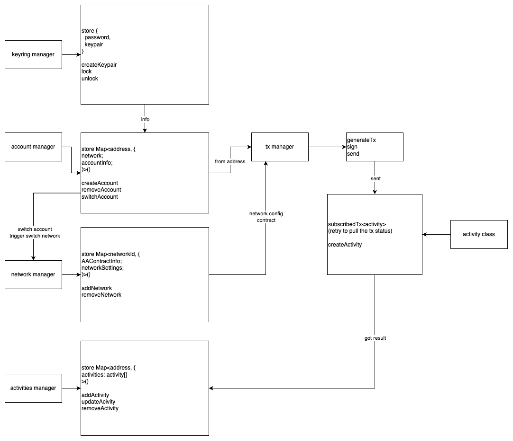

# Wallet App Architecture
*zewei@57blocks.com*

## Overview
When we need to develop a wallet product, we need to consider the design of the following modules and their interactions:

1. Keyring management system: Used for user login, lock screen, unlock, and generation and management of unique keypair in the wallet app.
2. Account management system: Used to manage multiple addresses generated by the user and their related configurations. The specific configurations are determined according to product requirements. Generally, for a regular EOA wallet, a user can have N addresses on one chain. However, if it is an Account Abstraction (Smart wallet) type wallet, it is usually set that a user can only have one address on one chain due to the characteristics of the Account Abstraction wallet.
3. Network management system: Used to manage the networks that the wallet app can connect to. It generally includes the network's name, ID, and RPC. Users can add or delete their own network configurations for the wallet.
4. Activities management system: Used to manage the activity records of the wallet app, generally transaction records. For transaction records, it is usually considered to record them on a web2 service for easy subsequent queries. Of course, they can also be obtained directly from the chain, but this would consume a lot of time.
5. Transaction management system: Used to manage the system for sending transactions. It generates corresponding transaction instances based on different chain configurations. It generally includes three functions: generating transactions, signing transactions, and sending transactions. Additional functions can be added according to actual development needs.

## Architecture Diagram
