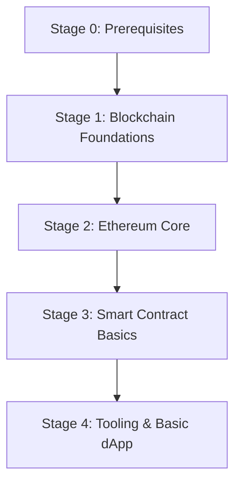

# Beginner

This guide is the beginner entry point for Ethereum. It focuses on fundamentals, basic tooling, and a first simple dApp. Deeper topics belong in Intermediate and Advanced.

## Learning Path

Milestones:

- Explain Account, Transaction, Gas, and Event in your own words.
- Deploy a simple Contract on a testnet and verify it.
- Build a minimal dApp that connects a wallet and reads/writes data.

Stage notes:

- Stage 0: JavaScript/TypeScript basics, CLI/Git, HTTP/JSON.
- Stage 1: Ledger and Consensus basics, Wallets, Keys, Transactions, UTXO vs Account (high-level).
- Stage 2: Account, Transaction, Gas, Event, State, Block, EVM (concept), JSON-RPC basics, Explorer usage.
- Stage 3: Solidity syntax and types, Storage vs Memory, ABI, Deploy to testnet.
- Stage 4: Hardhat or Foundry basics, ethers.js basics, simple dApp read/write flow.

## Developer Tooling

- Frameworks:
  - [Foundry Book](https://book.getfoundry.sh/) (Stage 4, recommended) - Fast testing and scripting toolchain for Solidity.
  - [Hardhat Docs](https://hardhat.org/docs) (Stage 4) - Flexible JavaScript-based development environment.
- Libraries:
  - [ethers.js Docs](https://docs.ethers.org/) (Stage 4, recommended) - Lightweight library for interacting with Ethereum.
  - [web3.js Docs](https://web3js.readthedocs.io/) (Stage 4) - Classic library for blockchain RPC interactions.
- Wallets:
  - [MetaMask](https://metamask.io/) (Stage 2-4) - Connect to dApps and manage testnet accounts.
- RPC Providers:
  - [Alchemy](https://www.alchemy.com/) (Stage 3-4) - Managed RPC endpoints and tooling for developers.
  - [QuickNode](https://www.quicknode.com/) (Stage 3-4) - Hosted RPC endpoints and developer tools.
- Explorers:
  - [Etherscan](https://etherscan.io/) (Stage 2-4) - Explore transactions, contracts, and verification status.

## Recommended Articles

- Overview:
  - [What is Ethereum?](https://ethereum.org/what-is-ethereum/) (Stage 1) - High-level overview of Ethereum’s purpose, features, and ecosystem.
- Core concepts:
  - [Accounts](https://ethereum.org/en/developers/docs/accounts/) (Stage 2) - How accounts work, including EOAs and contract accounts.
  - [Transactions](https://ethereum.org/en/developers/docs/transactions/) (Stage 2) - Transaction lifecycle, fields, and how state changes.
  - [EVM](https://ethereum.org/en/developers/docs/evm) (Stage 2) - What the EVM is and how it executes smart contract code.
  - [Gas](https://ethereum.org/en/developers/docs/gas/) (Stage 2) - Gas pricing, limits, and how fees are calculated.
  - [Nodes & Clients](https://ethereum.org/en/developers/docs/nodes-and-clients/) (Stage 2) - Client types and how nodes participate in the network.
  - [Networks](https://ethereum.org/en/developers/docs/networks/) (Stage 2) - Mainnet vs testnets and how to choose a network.
  - [Consensus algorithms](https://ethereum.org/en/developers/docs/consensus-mechanisms/) (Stage 1-2) - How Ethereum reaches agreement on blocks.

## Recommended Courses

- [WTF Solidity](https://github.com/AmazingAng/WTF-Solidity) (Stage 3-4) - Bite-sized Solidity lessons with code-first examples.
- [Full Blockchain Solidity Course (Python Edition)](https://github.com/smartcontractkit/full-blockchain-solidity-course-py) (Stage 3-4) - Comprehensive Solidity course with Python tooling and hands-on projects.

## Recommended Exercises

- [CryptoZombies](https://cryptozombies.io/) (Stage 3) - Interactive Solidity exercises through a gamified tutorial.
- [Truffle Suite Tutorial](https://www.trufflesuite.com/tutorial) (Stage 3-4) - Step-by-step guide to build and test a simple dApp.

## Recommended Books

- [Mastering Ethereum](https://masteringethereum.xyz/) (Stage 3-4) - Definitive guide to Ethereum and smart contract development.
- [Solidity Programming Essentials (2nd Edition)](https://github.com/PacktPublishing/Solidity-Programming-Essentials-Second-Edition) (Stage 3-4) - Practical Solidity book with example code.

## Recommended Videos

- [Solidity & Ethereum Bootcamp Playlist](https://www.youtube.com/playlist?list=PL16WqdAj66SCOdL6XIFbke-XQg2GW_Avg) (Stage 2-4) - Long-form playlist covering Solidity and Ethereum basics.

## Common Websites

### Frontend

| Site                                                                                           | Notes                                           |
| ---------------------------------------------------------------------------------------------- | ----------------------------------------------- |
| [MetaMask](https://docs.metamask.io/sdk/guides/use-deeplinks)                                  | Deeplink guide for wallet connection flows.     |
| [Binance](https://developers.binance.com/docs/binance-w3w/evm-compatible-provider#getdeeplink) | Deeplink API for Binance Web3 Wallet.           |
| [OKX](https://web3.okx.com/zh-hans/build/docs/waas/app-universal-link)                         | Universal link guide for OKX wallet connection. |

### Backend

| Site                                              | Notes                                    |
| ------------------------------------------------- | ---------------------------------------- |
| [Alchemy Docs](https://docs.alchemy.com/)         | RPC provider docs and developer tooling. |
| [QuickNode Docs](https://www.quicknode.com/docs/) | RPC endpoints and infrastructure guides. |

### Contracts

| Site                                                              | Notes                                     |
| ----------------------------------------------------------------- | ----------------------------------------- |
| [Solidity Docs](https://docs.soliditylang.org/)                   | Official language reference and basics.   |
| [OpenZeppelin Contracts](https://docs.openzeppelin.com/contracts) | Reusable contract libraries and patterns. |
