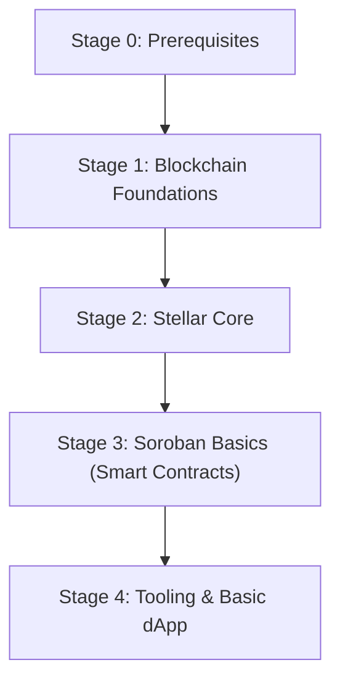

# Beginner

This guide is the beginner entry point for Stellar. It focuses on fundamentals, basic tooling, and a first simple dApp. Deeper topics belong in Intermediate and Advanced.

> Legend: ★ marks the most recommended resources.

## Learning Path

Milestones:

- Explain Account, Asset, Trustline, Operation, and Transaction in your own words.
- Use Horizon to query an account, submit a transaction, and read the result.
- Create an Asset and set up a Trustline on testnet.
- Deploy a minimal Soroban Contract to testnet and call it from a client.
- Build a minimal dApp that connects a wallet and signs/sends a transaction.

Stage notes:

- Stage 0: JavaScript/TypeScript basics, CLI/Git, HTTP/JSON.
- Stage 1: Ledger and Consensus basics, Wallets, Keys, Transactions (high-level).
- Stage 2: Stellar accounts model, assets, trustlines, operations, fees, sequence numbers, Horizon API, explorer usage.
- Stage 3: Soroban basics, contract storage, auth model, events, deploy/invoke flow (high-level).
- Stage 4: SDK basics, wallet integration, basic dApp read/write flow.

## Developer Tooling

- Network & APIs:
  - Horizon API (TBD)
- CLI:
  - Stellar CLI (TBD)
  - Soroban CLI (TBD)
- Smart contract development:
  - Soroban (TBD)
  - Rust toolchain (TBD)
- Client libraries:
  - Stellar SDKs (TBD)
- Wallets:
  - Wallets & signing (TBD)
- Explorers:
  - Stellar Explorer (TBD)

## Recommended Articles

- Overview (TBD)
- Core concepts (TBD)
- Soroban basics (TBD)

## Recommended Courses

- TBD

## Recommended Exercises

- TBD

## Recommended Books

- TBD

## Recommended Videos

- TBD
