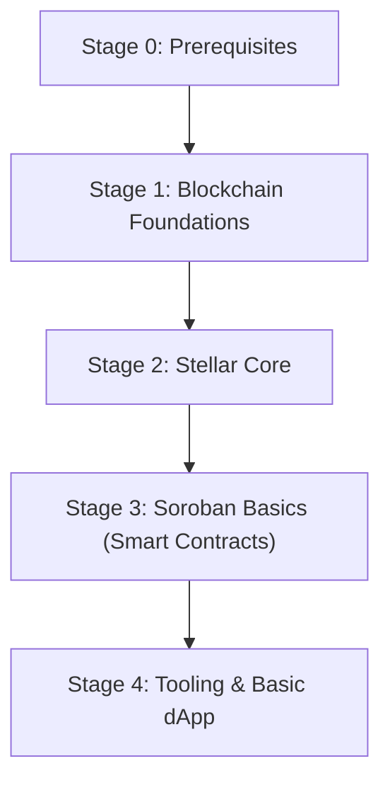

# Beginner

This guide is the beginner entry point for Stellar. It focuses on fundamentals, basic tooling, and a first simple dApp. Deeper topics belong in Intermediate and Advanced.

> Legend: ★ marks the most recommended resources.

## Learning Path

Milestones:

- Explain Account, Asset, Trustline, Operation, and Transaction in your own words.
- Use Horizon to query an account, submit a transaction, and read the result.
- Create an Asset and set up a Trustline on testnet.
- Deploy a minimal Soroban Contract to testnet and call it from a client.
- Build a minimal dApp that connects a wallet and signs/sends a transaction.
- Complete at least one contract from `soroban-examples` and one Soroban Quest track.

Stage notes:

- Stage 0: JavaScript/TypeScript basics, Rust basics (ownership/borrowing, Cargo), CLI/Git, HTTP/JSON.
- Stage 1: Ledger and Consensus basics, Wallets, Keys, Transactions (high-level).
- Stage 2: Stellar accounts model, assets, trustlines, operations, fees, sequence numbers, Horizon API, explorer usage.
- Stage 3: Soroban basics, contract storage, auth model, events, deploy/invoke flow (high-level).
- Stage 4: Stellar CLI and SDK basics, wallet integration, basic dApp read/write flow.

## Recommended Articles

- [★Stellar Data Structures](https://developers.stellar.org/docs/learn/fundamentals/stellar-data-structures)
- [★Smart Contract](https://developers.stellar.org/docs/learn/fundamentals/contract-development)
- [Building Rust Smart Contracts on Stellar Soroban (James Bachini)](https://jamesbachini.com/building-rust-smart-contracts-on-stellar-soroban/) - Written by a Stellar Developer in Residence; walks through building and deploying a Soroban contract from scratch. Continuously updated in 2025.

## Recommended Courses

- [Soroban Online Bootcamp](https://www.risein.com/bootcamps/soroban-online-bootcamp) - Free structured bootcamp from fundamentals to building dApps. Includes a completion certificate and is run in collaboration with Stellar.
- [A Full Stellar Course from Scratch](https://dev.to/ayomide_adebara_9b3eae139/a-full-stellar-course-from-scratch-21hd) - Community-authored full course covering blockchain basics, Soroban introduction, WASM, and Rust contract development and deployment.

## Recommended Exercises

- [★Example Contracts](https://github.com/stellar/soroban-examples)
- [Soroban Quest](https://quest.stellar.org/soroban) - Official gamified learning platform with increasing difficulty. Runs in a browser-based Gitpod environment with no local setup required; completion grants NFT rewards.

## Recommended Books

- [★The Rust Programming Language](https://doc.rust-lang.org/book/) - The Rust fundamentals you’ll need for Solana program development.

## Recommended Videos

- [★Stellar Official YouTube Channel & Meridian Conference Recordings](https://www.youtube.com/@StellarOrg) - Includes Soroban tutorials, developer workshops, and technical sessions from the annual Meridian conference. Continuously updated.
- [Soroban Developer Workshop: Write Your First Smart Contract](https://stellar.org/events/soroban-developer-workshop-write-your-first-smart-contract-on-soroban) - Official interactive workshop recording with a step-by-step guide to creating your first Soroban contract. Core concepts are still applicable.

## Developer Tooling

- CLI:
  - [Stellar CLI](https://developers.stellar.org/docs/tools/cli) - Key and account management, transaction build/sign/submit, Soroban contract deploy/invoke, and network configuration.
- Smart contract development:
  - [Contract SDKs (Soroban Rust SDK)](https://developers.stellar.org/docs/tools/sdks/contract-sdks) - Official SDK entry for building Soroban smart contracts.
  - [soroban-sdk (crates.io)](https://crates.io/crates/soroban-sdk) - Rust crate used to write and test Soroban contracts.
- Web tooling:
  - [Stellar Lab](https://lab.stellar.org/) - Browser-based tool for testing transactions, exploring RPC/Horizon, and deploying/invoking contracts.
- Client libraries:
  - [@stellar/stellar-sdk](https://stellar.github.io/js-stellar-sdk/) - JavaScript/TypeScript SDK for Horizon and Stellar RPC.
  - [stellar-sdk (Python)](https://stellar-sdk.readthedocs.io/) - Python SDK for building/signing transactions and interacting with Horizon/RPC.

## Common Websites

### Frontend

| Site                                                                  | Notes                                                                              |
| --------------------------------------------------------------------- | ---------------------------------------------------------------------------------- |
| [Freighter](https://www.freighter.app/)                               | Popular Stellar wallet for connecting dApps and signing transactions.              |
| [Freighter API](https://www.npmjs.com/package/@stellar/freighter-api) | JavaScript package for wallet connection, account access, and transaction signing. |

### Backend

| Site                                                                 | Notes                                                                        |
| -------------------------------------------------------------------- | ---------------------------------------------------------------------------- |
| [Horizon API](https://developers.stellar.org/docs/data/apis/horizon) | REST API for accounts, operations, payments, and transaction history.        |
| [Stellar RPC API](https://developers.stellar.org/docs/data/apis/rpc) | RPC interface for Soroban simulation, submission, and contract interactions. |

### Contracts

| Site                                                                                                       | Notes                                                  |
| ---------------------------------------------------------------------------------------------------------- | ------------------------------------------------------ |
| [Smart Contract Fundamentals](https://developers.stellar.org/docs/learn/fundamentals/contract-development) | Core Soroban concepts and contract lifecycle overview. |
