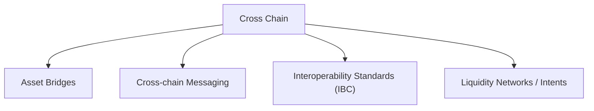

# Beginner

This guide is the beginner entry point for Cross Chain. It focuses on core concepts, trust models, and safe first hands-on actions. Deeper protocol internals and chain infrastructure belong in Intermediate and Advanced.

> Legend: ★ marks the most recommended resources.

## Learning Path

Suggested order (beginner-friendly):

1. Asset Bridges (move assets and verify both-chain txs)
2. Cross-chain Messaging (understand message delivery model)
3. Interoperability Standards (IBC mindset and relayer role)
4. Liquidity Networks / Intents (advanced routing abstraction)

Cross-cutting concepts (learn as needed): Finality, Relayer, Light Client, Oracle assumptions, upgrade/admin keys, and explorer-based verification.

Milestones:

- Explain Bridge, Relayer, Light Client, Finality, and Interoperability Protocol in your own words.
- Complete one small testnet cross-chain transfer and verify tx details on both source and destination explorers.
- Compare at least two interoperability protocols by trust assumptions and failure modes.

Category notes:

- Asset Bridges: lock-and-mint, burn-and-release, canonical vs wrapped assets, settlement/finality latency.
- Cross-chain Messaging: payload delivery, replay protection, ordering/retry semantics, relayer dependencies.
- Interoperability Standards (IBC): light-client-based verification, channel/packet model, trust-minimized communication.
- Liquidity Networks / Intents: route abstraction, solver/market-maker role, price and execution guarantees.

## Choose by Goal

| Goal                       | Focus              | Minimal action                                | What to verify                                                                   |
| -------------------------- | ------------------ | --------------------------------------------- | -------------------------------------------------------------------------------- |
| Move assets between chains | Bridge basics      | Do one small testnet transfer                 | Official domain, source/destination chain, token contract, final received amount |
| Send cross-chain message   | Messaging protocol | Send one basic message/call on testnet        | Message status, relayer path, delivery confirmation, retry behavior              |
| Evaluate a protocol safely | Trust model        | Compare 2 protocols and summarize assumptions | Who validates, what can fail, upgrade/admin keys, emergency controls             |

## Recommended Articles

- [★Tendermint Explained](https://docs.tendermint.com/v0.34/introduction/what-is-tendermint.html) - Consensus and finality basics that matter for cross-chain safety assumptions.
- [Cosmos SDK Documentation](https://docs.cosmos.network/) - Foundation for app-chains and interoperability ecosystem context.
- [Ethereum Networking Layer](https://ethereum.org/en/developers/docs/networking-layer/) - Useful networking background for understanding relayers and node communication.

## Recommended Courses

- [★Cosmos SDK Developer Course (Interchain Academy)](https://ida.interchain.io/academy) - Structured content for chain and interoperability fundamentals.

## Recommended Exercises

- [★Chainlink CCIP: Get Started with CCIP (EVM)](https://docs.chain.link/ccip/getting-started/evm) - Step-by-step lab to deploy sender/receiver contracts and send one cross-chain message on testnets.
- [LayerZero V2: Create Your First OApp](https://docs.layerzero.network/v2/get-started/create-lz-oapp/start) - Guided quickstart using `create-lz-oapp` to scaffold, deploy, and test a basic omnichain app.
- [Wormhole: Get Started with Wrapped Token Transfers (WTT)](https://wormhole.com/docs/products/token-transfers/wrapped-token-transfers/get-started/) - Hands-on guide for manual/automatic cross-chain token transfer with SDK examples.
- [Axelar: Programmatically Create a New Interchain Token](https://docs.axelar.dev/dev/send-tokens/interchain-tokens/developer-guides/programmatically-create-a-token/) - End-to-end tutorial that creates and transfers an interchain token between testnets.

## Recommended Videos

- [★Cosmos YouTube Channel](https://www.youtube.com/@CosmosEcosystem) - Cosmos SDK and interoperability ecosystem learning content.
- [Whiteboard Crypto](https://www.youtube.com/@WhiteboardCrypto) - Visual explanations for blockchain and cross-chain-adjacent concepts.

## Notable Protocols

| Protocol  | Category                  | Trust Model (High-level)                  | Notes                                                  |
| --------- | ------------------------- | ----------------------------------------- | ------------------------------------------------------ |
| IBC       | Interoperability protocol | Light-client-based verification           | Native in Cosmos ecosystem; strong verification model. |
| LayerZero | Cross-chain messaging     | External verification network + endpoints | Popular messaging stack across EVM ecosystems.         |
| Axelar    | Cross-chain messaging     | External validator set                    | General message passing and token transfer support.    |
| Wormhole  | Messaging / Bridge infra  | Guardian network                          | Widely integrated in multi-chain apps.                 |
