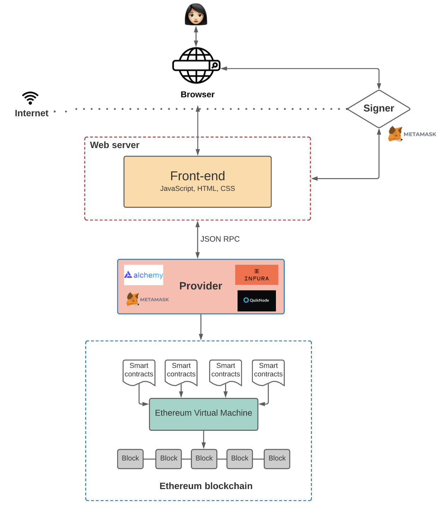

A dapp has its backend code running on a decentralized peer-to-peer network. Contrast this with an app where the backend code is running on centralized servers.

A dapp can have frontend code and user interfaces written in any language (just like an app) to make calls to its backend. Furthermore, its frontend can get hosted on decentralized storage such as [IPFS](https://ipfs.io/).

- **Decentralized** - dapps operate on Ethereum, an open public decentralized platform where no one person or group has control
- **Deterministic** - dapps perform the same function irrespective of the environment in which they get executed
- **Turing complete** - dapps can perform any action given the required resources
- **Isolated** - dapps are executed in a virtual environment known as Ethereum Virtual Machine so that if the smart contract has a bug, it won’t hamper the normal functioning of the blockchain network

# Architecture of Dapp

# Dapp Frontend

For this tutorial, we will focus on frontend side of Dapp.

The frontend of a Dapp is built very similarly to a traditional web application (HTML, CSS & JavaScript), but instead of interacting with a database via an API, Dapp interacts directly with the blockchain via a smart contract. We can even host the frontend on decentralized storage such as [IPFS](https://ipfs.io/) to be fully decentralized.

**Traditional web application:** Client → API → Database  
**Decentralized application:** Client → Smart Contract → Blockchain
