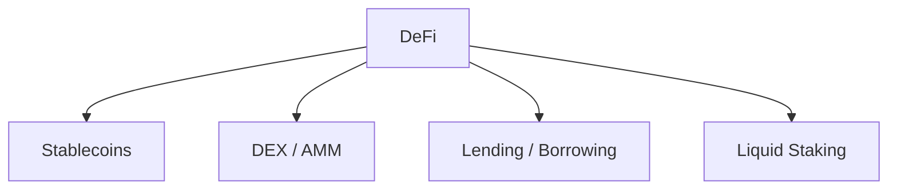

# Beginner

This guide is the beginner entry point for DeFi. It focuses on mental models, core primitives (Stablecoin, AMM/DEX, Lending), and security hygiene. Deeper topics (MEV, perps/options, structured products, cross-chain design) belong in Intermediate and Advanced.

> Legend: ★ marks the most recommended resources.

## Learning Path

Suggested order (beginner-friendly):

1. Stablecoins (unit of account)
2. DEX / AMM (swap + liquidity)
3. Lending / Borrowing (collateral + liquidation)
4. Liquid Staking (LST basics)

Cross-cutting concepts (learn as needed): Oracles, bridges, MEV, and basic security hygiene.

## Choose by Goal

| Goal                   | Focus categories                 | Minimal action                                   | What to verify                                                                                                           |
| ---------------------- | -------------------------------- | ------------------------------------------------ | ------------------------------------------------------------------------------------------------------------------------ |
| Swap tokens            | DEX / AMM                        | Swap a small amount on a reputable UI            | Domain & chain/network, token address, slippage, route, fee, min received, approvals/delegates, verify tx in explorer    |
| Earn yield (simple)    | Stablecoins, Lending / Borrowing | Supply a stablecoin to a lending market          | APY source (interest vs incentives), withdrawal path, approvals/delegates, protocol risk, verify tx in explorer          |
| Earn yield (liquidity) | DEX / AMM                        | Add liquidity to a 2-token pool, then remove it  | LP shares, fee income vs price changes, impermanent loss risk, approvals/delegates, verify tx in explorer                |
| Borrow against assets  | Lending / Borrowing, Oracles     | Deposit collateral and borrow a small amount     | Health factor, liquidation threshold/price, interest rate, oracle dependency, approvals/delegates, verify tx in explorer |
| Liquid staking         | Liquid Staking                   | Stake to mint an LST, then redeem (if supported) | LST discount/depeg, withdrawal queue, validator/contract risk, verify tx in explorer                                     |

Milestones:

- Explain Stablecoin, AMM, Liquidity Pool, LP Token, APR vs APY, Collateral, and Liquidation in your own words.
- Do a Swap, add/remove Liquidity, and understand where fees come from.
- Deposit Collateral, Borrow, repay, and track health factor / liquidation price.
- Review token approvals/allowances (or delegates) and revoke anything risky.

Category notes:

- Stablecoins: collateralization/peg mechanism, depeg risk, issuer risk, redemption path.
- DEX / AMM: slippage/price impact, fees, impermanent loss (LP), MEV (high-level).
- Lending / Borrowing: collateral factor, liquidation threshold, interest rate model, oracle risk.
- Liquid Staking: validator & smart contract risk, LST discount/depeg, withdrawal queue (if any).
- Later (optional): Yield aggregators, derivatives (perps/options), bridges, and MEV mechanics.

## Minimal Must-Learn Path

Recommended MVP duration: 1 week.
If a resource is long, complete only the required part listed in each step.

1. Article (Day 1): read [★DeFi](https://ethereum.org/defi/). Required outcome: explain Stablecoin, AMM, Lending, and Liquid Staking in your own words.
2. Video-first intuition (Day 2): watch selected beginner videos from [★Finematics](https://www.youtube.com/c/finematics). Required outcome: understand how swaps, pools, LP fees, and liquidation work conceptually.
3. Course (Day 3-4): complete beginner-relevant DeFi sections from [★LearnWeb3: Stacks Developer Degree](https://learnweb3.io/degrees/stacks-developer-degree/) and use [DeFi Learning (F22)](https://defi-learning.org/f22) as supplementary reading. Required outcome: map each DeFi primitive to one real protocol use case.
4. Book (Day 5-6): read selected chapters from [★DeFi and the Future of Finance](https://www.dedao.cn/ebook/detail?id=kQX7yD4MVoN52PDAnlRdzK6qvg8XEwbmvo3ZJjBb7rO4ypxGa9LeQm1kYng9YzK5). Required part: market structure, protocol primitives, and key risks.
5. Consolidation (Day 7): skim risk-oriented sections in [How to DeFi Advanced](https://www.are.na/block/12525791) and reinforce with 2-3 topic videos from [Whiteboard Crypto](https://www.youtube.com/@WhiteboardCrypto). Required outcome: complete one safe practice flow (swap or lending) and verify approvals + tx details in an explorer.

## Recommended Articles

- [★DeFi](https://ethereum.org/defi/) - Beginner-friendly overview of DeFi, common primitives, and risks.

## Recommended Courses

- [★LearnWeb3: Stacks Developer Degree](https://learnweb3.io/degrees/stacks-developer-degree/) - A structured, hands-on curriculum for learning Web3 development on Stacks (Bitcoin L2), including smart contracts and building real projects.
- [DeFi Learning (F22)](https://defi-learning.org/f22) - A course-style collection of DeFi topics and readings focused on protocol design, mechanics, and risk trade-offs.

## Recommended Books

- [★DeFi and the Future of Finance](https://www.dedao.cn/ebook/detail?id=kQX7yD4MVoN52PDAnlRdzK6qvg8XEwbmvo3ZJjBb7rO4ypxGa9LeQm1kYng9YzK5) - A overview of DeFi fundamentals, market structure, and how DeFi may reshape traditional finance.
- [How to DeFi Advanced](https://www.are.na/block/12525791) - An advanced DeFi guide covering more complex primitives, strategies, and risk considerations.

## Recommended Videos

- [★Finematics](https://www.youtube.com/c/finematics): An education-focused channel that explains DeFi concepts (AMMs, liquidity pools, lending, and smart contract mechanics) with clear, structured breakdowns.
- [Whiteboard Crypto](https://www.youtube.com/@WhiteboardCrypto): A whiteboard-style education channel that uses analogies and simple visuals to make crypto, blockchain, and DeFi topics easy to understand.

## Notable Protocols

### Ethereum

| Protocol | Category               | Links                                                                         |
| -------- | ---------------------- | ----------------------------------------------------------------------------- |
| Uniswap  | DEX / AMM              | [App](https://app.uniswap.org/) · [Docs](https://docs.uniswap.org/)           |
| Aave     | Lending / Borrowing    | [App](https://app.aave.com/) · [Docs](https://docs.aave.com/)                 |
| Compound | Lending / Borrowing    | [App](https://app.compound.finance/) · [Docs](https://docs.compound.finance/) |
| Curve    | DEX / Stable-swap AMM  | [App](https://curve.fi/) · [Docs](https://docs.curve.fi/)                     |
| MakerDAO | Stablecoin (DAI) / CDP | [App](https://app.spark.fi/) · [Docs](https://docs.makerdao.com/)             |
| Lido     | Liquid Staking         | [App](https://stake.lido.fi/) · [Docs](https://docs.lido.fi/)                 |
| Yearn    | Yield Aggregator       | [App](https://yearn.fi/) · [Docs](https://docs.yearn.fi/)                     |

### Solana

| Protocol | Category            | Links                                                                     |
| -------- | ------------------- | ------------------------------------------------------------------------- |
| Jupiter  | DEX Aggregator      | [App](https://jup.ag/) · [Docs](https://station.jup.ag/docs)              |
| Orca     | DEX / AMM           | [App](https://www.orca.so/) · [Docs](https://docs.orca.so/)               |
| Raydium  | DEX / AMM           | [App](https://raydium.io/) · [Docs](https://docs.raydium.io/)             |
| Kamino   | Lending / Leverage  | [App](https://kamino.finance/) · [Docs](https://docs.kamino.finance/)     |
| marginfi | Lending / Borrowing | [App](https://app.marginfi.com/) · [Docs](https://docs.marginfi.com/)     |
| Drift    | Perpetuals (Perps)  | [App](https://app.drift.trade/) · [Docs](https://docs.drift.trade/)       |
| Marinade | Liquid Staking      | [App](https://marinade.finance/) · [Docs](https://docs.marinade.finance/) |
