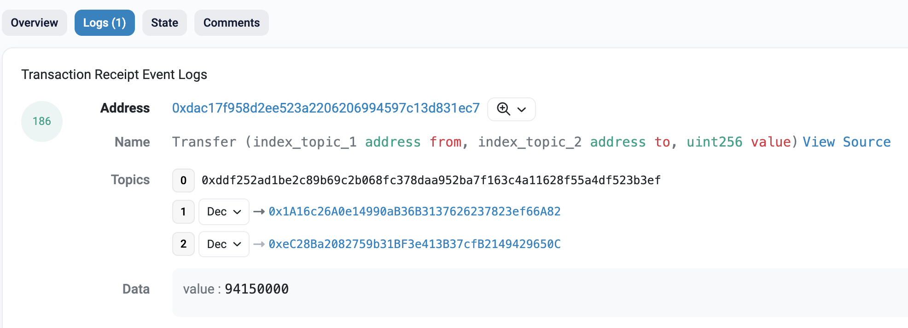

# Event

_wei@57blocks.com_

## What are Logs and Events on Ethereum? 
All Ethereum smart contracts generally have the ability to emit events when they execute. When this happens, the contracts additionally generate logs and provide insight into the events, which we can find on transaction receipts. Consequently, whenever a transaction is “mined”, it becomes possible to view event logs related to the particular transaction by querying the blockchain network. Moreover, note that within the Ethereum ecosystem, it is not uncommon to use the terms “events” and “logs” synonymously. 

Ethereum Virtual Machine (EVM) has five opcodes – or “operation codes” – for emitting Ethereum event logs: LOG0, LOG1, LOG2, LOG3, and LOG4. Web3 developers can use these opcodes to create log records describing events within smart contracts. This can, for instance, be Ethereum events, such as when NFTs change ownership or token transfers occurs. 

Furthermore, every Ethereum log consists of two main components: topics and data. Log topics are 32-byte ”words” describing the inner workings of an event. The various opcodes are required to describe the number of topics included in log records. To exemplify, let us briefly compare the differences between LOG1 and LOG4. In short, LOG1 includes only one topic; meanwhile, LOG4 includes four. This further means that the maximum number of topics we can include in a log record is four.

## Topics

The first part of all Ethereum logs consists of an array of various topics describing its associated event. The initial topic is usually the signature or hash of the event name, including its parameters. However, there are exceptions, and an example is anonymous transactions, where we deliberately exclude this signature.

## Data
The other component of Ethereum event logs is data, which we will briefly explore in this section. Both topics and data work best in unison since they have their own pros and cons. For instance, topics are searchable; meanwhile, the data is not. On the other hand, including data in event logs is much cheaper than topics. 

## Where is an Ethereum Log Stored
To understand the location/storage of Ethereum logs, we must briefly return to the intricacies of smart contracts. Ethereum smart contracts store information in one of two distinct ways: account storage and event logs. The account storage contains information and data in relation to the smart contract’s state. Moreover, this is data that smart contracts themselves can access. 

Whenever a smart contract emits an event, the associated log data is written and recorded in a transaction receipt. All transactions have a particulate receipt containing transaction outcomes, which includes status and event logs. Consequently, in addition to the logs, a transaction receipt also contains data like the gas amounts used, log blooms, etc. 

## Example
The most common event on the Ethereum blockchain at the time of writing this article is the Transfer event that is emitted by ERC20 tokens when someone transfers tokens.
```solidity
event Transfer(address indexed from, address indexed to, uint256 value);
```

The event signature is declared inside of the contract code and can be emitted with the emit keyword. For example, the transfer event logs who sent the transfer (from), to who (to) and how much tokens were transferred (value).


## References

[Ethereum Logs and Events – What are Event Logs on the Ethereum Network?](https://moralis.io/ethereum-logs-and-events-what-are-event-logs-on-the-ethereum-network/)

[Logging Data From Smart Contracts With Events](https://ethereum.org/en/developers/tutorials/logging-events-smart-contracts/)

[Understanding event logs on the Ethereum blockchain](https://medium.com/mycrypto/understanding-event-logs-on-the-ethereum-blockchain-f4ae7ba50378)