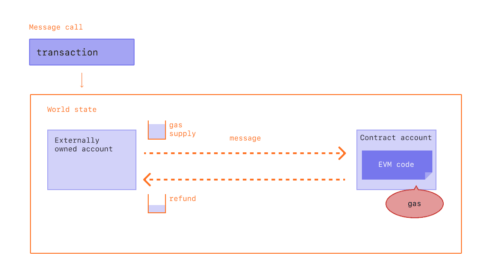

# Gas

_wei@57blocks.com_

## What is Gas
Gas refers to the unit that measures the amount of computational effort required to execute specific operations on the Ethereum network.

Since each Ethereum transaction requires computational resources to execute, each transaction requires a fee. Gas refers to the fee required to execute a transaction on Ethereum, regardless of transaction success or failure.

Gas fees are paid in Ethereum's native currency, ether (ETH). Gas prices are denoted in gwei, which itself is a denomination of ETH - each gwei is equal to 0.000000001 ETH (10-9 ETH). For example, instead of saying that your gas costs 0.000000001 ether, you can say your gas costs 1 gwei. The word 'gwei' itself means 'giga-wei', and it is equal to 1,000,000,000 wei. Wei itself (named after Wei Dai, creator of b-money) is the smallest unit of ETH.

## Calculating Fees
High gas fees are due to the popularity of Ethereum. Performing any operation on Ethereum requires consuming gas, and gas space is limited per block. Fees are used to pay for calculations, storing or manipulating data, or transferring tokens; each consuming different amounts of "gas" units. 

Gas price alone does not actually determine how much we have to pay for a particular transaction. To calculate the transaction fee, we have to multiply the gas used by the base gas fee, which is measured in gwei.

One of the main benefits of the London upgrade is improving the user's experience when setting transaction fees. For wallets that support the upgrade, instead of explicitly stating how much you are willing to pay to get your transaction through, wallet providers will automatically set a recommended transaction fee (base fee + recommended priority fee) to reduce the amount of complexity burdened onto their users

### Base Fee
Every block has a base fee which acts as a reserve price. To be eligible for inclusion in a block the offered price per gas must at least equal the base fee. The base fee is calculated independently of the current block and is instead determined by the blocks before it - making transaction fees more predictable for users. When the block is mined this base fee is "burned", removing it from circulation.

### Priority Fee
With the new base fee getting burned, the London Upgrade introduced a priority fee (tip) to incentivize miners to include a transaction in the block. Without tips, miners would find it economically viable to mine empty blocks, as they would receive the same block reward. Under normal conditions, a small tip provides miners a minimal incentive to include a transaction. For transactions that need to get preferentially executed ahead of other transactions in the same block, a higher tip will be necessary to attempt to outbid competing transactions.

### Max Fee
To execute a transaction on the network, users can specify a maximum limit they are willing to pay for their transaction to be executed. This optional parameter is known as the maxFeePerGas. For a transaction to be executed, the max fee must exceed the sum of the base fee and the tip. The transaction sender is refunded the difference between the max fee and the sum of the base fee and tip.

### Gas Limit
Gas limit refers to the maximum amount of gas you are willing to consume on a transaction. More complicated transactions involving smart contracts require more computational work, so they require a higher gas limit than a simple payment. A standard ETH transfer requires a gas limit of 21,000 units of gas.

## References
[Gas and Fees](https://ethereum.org/en/developers/tutorials/logging-events-smart-contracts/)