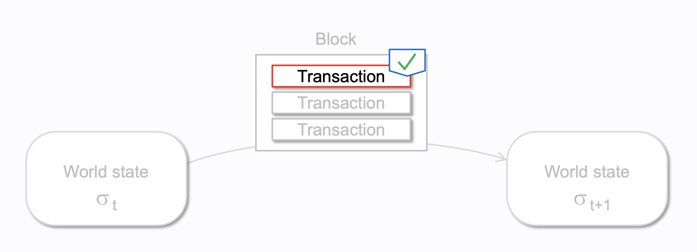

# Transaction

_wei@57blocks.com_

## What's a Transaction?
An Ethereum transaction refers to an action initiated by an externally-owned account(EOA), in other words an account managed by a human, not a contract. 

For example, if Bob sends Alice 1 ETH, Bob's account must be debited and Alice's must be credited. This state-changing action takes place within a transaction.


## Types of Transactions

On Ethereum there are a few different types of transactions:

`Regular transactions`: a transaction from one account to another.

eg. Bob sends Alice 1 ETH

`Contract deployment transactions`: a transaction without a 'to' address, where the data field is used for the contract code.
eg. Bob deploy a token contract

`Execution of a contract`: a transaction that interacts with a deployed smart contract. In this case, 'to' address is the smart contract address.

eg. Bob sends Alice 1 unit of token

## Accounts

There are two types of accounts, smart contract accounts and externally owned accounts (EOA):

`Externally owned accounts (EOA)` refer to accounts that humans manage, such as a personal Metamask or Coinbase wallet. This account is identified by a public key (also known as an account address) and is controlled by a private key. The public key is derived from the private key using a cryptographic algorithm. It's important to note that these accounts cannot store information other than your accounts balance and nonce.

`Smart contract accounts` (also known as contract accounts) also contain an address to balance mapping but differ because they can also include EVM code and storage. Contract accounts control themselves by the logic in the EVM code stored within the account.

Ethereum utilizies the elliptic curve digital signature algorithm (ECDSA) to prove authentication (i.e., prove that we have a private key for our public address) and verify that our transaction comes from the account signing the transaction and is not fraudulent.

## Transaction Object

A submitted transaction includes the following information:

`recipient` – the receiving address (if an externally-owned account, the transaction will transfer value. If a contract account, the transaction will execute the contract code)

`signature` – the identifier of the sender. This is generated when the sender's private key signs the transaction and confirms the sender has authorized this transaction

`nonce` - a sequentially incrementing counter which indicates the transaction number from the account

`value` – amount of ETH to transfer from sender to recipient (in WEI, a denomination of ETH)

`data` – optional field to include arbitrary data

`gasLimit` – the maximum amount of gas units that can be consumed by the transaction. Units of gas represent computational steps

`maxPriorityFeePerGas` - the maximum price of the consumed gas to be included as a tip to the validator

`maxFeePerGas` - the maximum fee per unit of gas willing to be paid for the transaction (inclusive of baseFeePerGas and maxPriorityFeePerGas)

Gas is a reference to the computation required to process the transaction by a validator. Users have to pay a fee for this computation. The gasLimit, and maxPriorityFeePerGas determine the maximum transaction fee paid to the validator. 

The unsigned transaction 1559 object will look a little like this:
```python
fields = [
  ("chainId", big_endian_int),
  ("nonce", big_endian_int),
  ("maxPriorityFeePerGas", big_endian_int),
  ("maxFeePerGas", big_endian_int),
  ("gas", big_endian_int),
  ("to", Binary.fixed_length(20, allow_empty=True)),
  ("value", big_endian_int),
  ("data", binary),
  ("accessList", access_list_sede_type),
]
```

But a transaction object needs to be signed using the sender's private key. This proves that the transaction could only have come from the sender and was not sent fraudulently.

The signed transaction 1559 object will look a little like this:
```python
fields = [
  ("chainId", big_endian_int),
  ("nonce", big_endian_int),
  ("maxPriorityFeePerGas", big_endian_int),
  ("maxFeePerGas", big_endian_int),
  ("gas", big_endian_int),
  ("to", Binary.fixed_length(20, allow_empty=True)),
  ("value", big_endian_int),
  ("data", binary),
  ("accessList", access_list_sede_type),
  ("yParity", boolean),
  ("r", big_endian_int),
  ("s", big_endian_int),
]
```

## Typed Transaction Envelope
Ethereum has evolved to support multiple types of transactions to allow for new features such as access lists and EIP-1559 (type=2) to be implemented without affecting legacy transaction formats.

EIP-2718 is what allows for this behaviour. Transactions are interpreted as:

TransactionType || TransactionPayload

Where the fields are defined as:

TransactionType - a number between 0 and 0x7f, for a total of 128 possible transaction types.

TransactionPayload - an arbitrary byte array defined by the transaction type.

code example to pack the 1559 transaction 
```python
encoded_transaction = bytes([2]) + rlp.encode(signed_transaction_1559)  # Add 0x02 to the front for type 2 transactions
```

## The Data Field
The vast majority of transactions access a contract from an externally-owned account. Most contracts are written in Solidity and interpret their data field in accordance with the application binary interface (ABI).

The first four bytes specify which function to call, using the hash of the function's name and arguments. You can sometimes identify the function from the selector using this database.

The rest of the calldata is the arguments, encoded as specified in the ABI specs.

For example, lets look at [this transaction](https://etherscan.io/tx/0xd0dcbe007569fcfa1902dae0ab8b4e078efe42e231786312289b1eee5590f6a1). Use Click to see More to see the calldata.

The function selector is `0xa9059cbb`. There are several known functions with this signature. In this case the contract source code has been uploaded to Etherscan, so we know the function is `transfer(address,uint256)`.

The rest of the data is:
```
0000000000000000000000004f6742badb049791cd9a37ea913f2bac38d01279
000000000000000000000000000000000000000000000000000000003b0559f4
```
According to the ABI specifications, integer values (such as addresses, which are 20-byte integers) appear in the ABI as 32-byte words, padded with zeros in the front. So we know that the to address is `4f6742badb049791cd9a37ea913f2bac38d01279`. The value is 0x3b0559f4 = 990206452.

## Send Transaction
The code example to send transaction
```javascript
const ethers = require("ethers");

const privateKey = ("ADD_YOUR_PRIVATE_KEY_HERE").toString('hex');
const wallet = new ethers.Wallet(privateKey);
const address = wallet.address;
const httpsUrl = "ADD_YOUR_HTTP_URL_HERE";

const init = async function () {
  const httpsProvider = new ethers.providers.JsonRpcProvider(httpsurl);

  let nonce = await httpsProvider.getTransactionCount(address);

  let feeData = await httpsProvider.getFeeData();

  const tx = {
    type: 2,
    nonce: nonce,
    to: "0x8D97689C9818892B700e27F316cc3E41e17fBeb9", // Address to send to
    maxPriorityFeePerGas: feeData["maxPriorityFeePerGas"], // Recommended maxPriorityFeePerGas
    maxFeePerGas: feeData["maxFeePerGas"], // Recommended maxFeePerGas
    value: ethers.utils.parseEther("0.01"), // .01 ETH
    gasLimit: "21000", // basic transaction costs exactly 21000
    chainId: 42, // Ethereum network id
  };
  const signedTx = await wallet.signTransaction(tx);
  const txHash = ethers.utils.keccak256(signedTx);
  httpsProvider.sendTransaction(signedTx).then(console.log);
};

init();
```

After send the transaction, we can use the RPC eth_getTransactionByHash to get the content of the transaction
Example response:
```sh
// Request
curl -X POST --data '{"jsonrpc":"2.0","method":"eth_getTransactionByHash","params":["0x88df016429689c079f3b2f6ad39fa052532c56795b733da78a91ebe6a713944b"],"id":1}'
// Result
{
  "jsonrpc":"2.0",
  "id":1,
  "result":{
    "blockHash":"0x1d59ff54b1eb26b013ce3cb5fc9dab3705b415a67127a003c3e61eb445bb8df2",
    "blockNumber":"0x5daf3b", // 6139707
    "from":"0xa7d9ddbe1f17865597fbd27ec712455208b6b76d",
    "gas":"0xc350", // 50000
    "gasPrice":"0x4a817c800", // 20000000000
    "hash":"0x88df016429689c079f3b2f6ad39fa052532c56795b733da78a91ebe6a713944b",
    "input":"0x68656c6c6f21",
    "nonce":"0x15", // 21
    "to":"0xf02c1c8e6114b1dbe8937a39260b5b0a374432bb",
    "transactionIndex":"0x41", // 65
    "value":"0xf3dbb76162000", // 4290000000000000
    "v":"0x25", // 37
    "r":"0x1b5e176d927f8e9ab405058b2d2457392da3e20f328b16ddabcebc33eaac5fea",
    "s":"0x4ba69724e8f69de52f0125ad8b3c5c2cef33019bac3249e2c0a2192766d1721c"
  }
}
```

After transaction is mind to block, we can use the RPC eth_getTransactionReceipt to read the transaction receipt 
```sh
// Request
curl -X POST --data '{"jsonrpc":"2.0","method":"eth_getTransactionReceipt","params":["0x85d995eba9763907fdf35cd2034144dd9d53ce32cbec21349d4b12823c6860c5"],"id":1}'
// Result
{
  "jsonrpc": "2.0",
  "id": 1,
  "result": {
    "blockHash":
      "0xa957d47df264a31badc3ae823e10ac1d444b098d9b73d204c40426e57f47e8c3",
    "blockNumber": "0xeff35f",
    "contractAddress": null, // string of the address if it was created
    "cumulativeGasUsed": "0xa12515",
    "effectiveGasPrice": "0x5a9c688d4",
    "from": "0x6221a9c005f6e47eb398fd867784cacfdcfff4e7",
    "gasUsed": "0xb4c8",
    "logs": [{
      // logs as returned by getFilterLogs, etc.
    }],
    "logsBloom": "0x00...0", // 256 byte bloom filter
    "status": "0x1",
    "to": "0xc02aaa39b223fe8d0a0e5c4f27ead9083c756cc2",
    "transactionHash":
      "0x85d995eba9763907fdf35cd2034144dd9d53ce32cbec21349d4b12823c6860c5",
    "transactionIndex": "0x66",
    "type": "0x2"
  }
}

```

## Transaction Lifesycle

Once the transaction has been submitted the following happens:

1.Once you send a transaction, cryptography generates a transaction hash: `0x97d99bc7729211111a21b12c933c949d4f31684f1d6954ff477d0477538ff017`

2.The transaction is then broadcast to the network and included in a pool with lots of other transactions.

3.A validator must pick your transaction and include it in a block in order to verify the transaction and consider it "successful".

4.As time passes the block containing your transaction will be upgraded to "justified" then "finalized". These upgrades make it much more certain that your transaction was successful and will never be altered. Once a block is "finalized" it could only ever be changed by an attack that would cost many billions of dollars.

### Transactions in Mempool
A mempool, or memory pool, is a collection of pending transactions waiting for validation from a node before they are committed to a new block on the blockchain. Put simply, the mempool is a staging area for unconfirmed transactions in a node. Every blockchain node in the network has a mempool, and they all intercommunicate to share information about the latest pending transactions.

Traditionally, mempool transactions fall into one of the following three buckets:

- `Pending Transactions`
Transactions that have been submitted to the mempool and are waiting to be included in the next block mined by a miner. Learn more about debugging pending transactions..

- `Mined Transactions`
Transactions that have been selected and are included in the latest block by a miner. The results of these transactions are then broadcasted to the entire network. Mined transactions can have two statuses:

  - `Success`
These transactions are successfully executed and modify state on-chain. The status field for a successful transaction is 0x1.

  - `Failure/Execution Reverted`
These transactions are not successfully executed but are still included in the block. This can occur if the execution process hits an error, runs out of gas, or encounters some other issue. The status field for a failed transaction is 0x0.

To check whether a mined transaction was successful or failed you can call `eth_getTransactionReceipt` passing in your transaction hash. In the payload, you will find a status field which will be 0x0 for failed and 0x1 for success.

- `Dropped Transactions`
Transactions that have failed to be confirmed. This could happen because the transaction failed certain validation tests, the nonce was incorrect, the submitted gas price was too low and it timed out, or a number of other errors. Dropped transactions return their assets and gas fees to the sender, as if the transaction never happened.

### Dropped & Replaced Transactions
A new category has become a common feature request by developers. When a transaction is dropped, the sender will oftentimes send a replacement transaction with the same nonce value to “replace” that failed transaction.

If the second transaction is confirmed onto the blockchain (e.g. by sending a new transaction with the same nonce and a higher gas price), the “dropped” transaction will be moved into the new transaction status category known as “Dropped & Replaced”.

Similarly, if multiple transactions are simultaneously sent with the same nonce value, typically the transaction with a higher transaction fee will be selected for confirmation onto a block. The other transactions will fall into the “Dropped & Replaced” category.

This transaction status is useful for smart contract developers as it allows them to track which transactions have been successfully re-broadcasted to the blockchain network (“dropped and replaced”) and which dropped transactions still need to be re-broadcasted (“dropped”).

## References
[Transactions](https://ethereum.org/en/developers/docs/transactions/)

[Ethereum Transactions - Pending, Mined, Dropped & Replaced](https://docs.alchemy.com/docs/ethereum-transactions-pending-mined-dropped-replaced)

[What are Ethereum Transactions](https://www.quicknode.com/guides/ethereum-development/transactions/what-are-ethereum-transactions/#)

[EIP-155: Simple replay attack protection](https://eips.ethereum.org/EIPS/eip-155)

[EIP-1559: Fee market change for ETH 1.0 chain](https://eips.ethereum.org/EIPS/eip-1559)

[EIP-2718: Typed Transaction Envelope](https://eips.ethereum.org/EIPS/eip-2718)