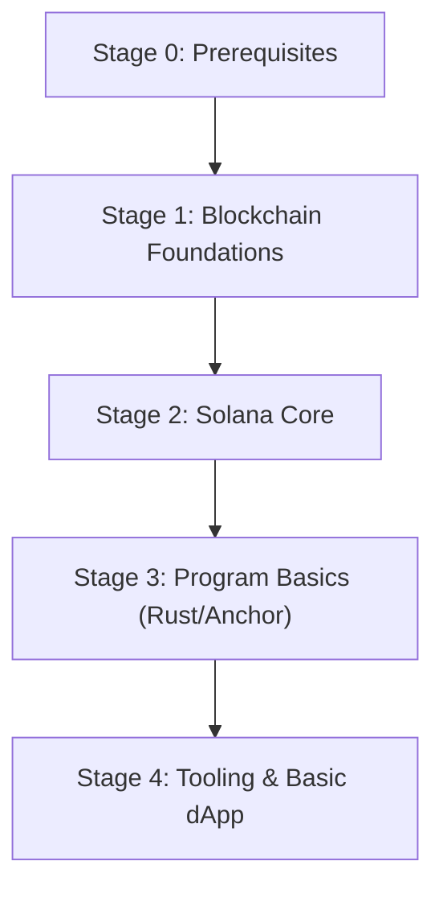

# Beginner

This guide is the beginner entry point for Solana. It focuses on fundamentals, basic tooling, and a first simple dApp. Deeper topics belong in Intermediate and Advanced.

## Learning Path

Milestones:

- Explain Account, Instruction, Transaction, Blockhash, Fee, and Compute Units in your own words.
- Create a keypair, request a devnet airdrop, and send a transfer transaction.
- Create an SPL Token mint, create an ATA, mint tokens, and transfer tokens.
- Deploy a simple Anchor program to devnet and interact with it from a TypeScript client.
- Build a minimal dApp that connects a wallet and signs/sends a transaction.

Stage notes:

- Stage 0: JavaScript/TypeScript basics, Rust basics, CLI/Git, HTTP/JSON.
- Stage 1: Ledger and Consensus basics, Wallets, Keys, Transactions (high-level).
- Stage 2: Solana accounts model, programs, instructions, transaction lifecycle, blockhash & fee payer, commitment/finality.
- Stage 3: Rust + Anchor basics, account constraints, PDA, CPI (high-level), local testing workflow.
- Stage 4: `@solana/web3.js`, wallet adapter, reading data + sending transactions, explorer usage.

## Developer Tooling

- CLI:
  - [Solana CLI](https://docs.solana.com/cli) - Keypairs, airdrops, transfers, program deploy, and cluster config.
- Program development:
  - [Rust](https://www.rust-lang.org/tools/install) - Language/toolchain for Solana programs.
  - [Anchor](https://www.anchor-lang.com/) - Framework for writing and testing Solana programs.
- Client libraries:
  - [`@solana/kit`](https://github.com/anza-xyz/kit) - JavaScript SDK for building Solana apps for Node, web, and React Native (renamed from the 2.x line of `@solana/web3.js`).
  - [`@solana/web3.js`](https://github.com/solana-foundation/solana-web3.js) - First-generation JavaScript SDK for Solana RPC and transactions (1.x line).
  - [`@coral-xyz/anchor`](https://www.anchor-lang.com/docs/clients/typescript) - Client for Anchor programs.
- Wallets:
  - [Phantom](https://phantom.app/) - Popular wallet for signing transactions and connecting to Solana dApps.
  - [Backpack](https://backpack.app/) - Modern wallet experience with strong dApp integration and multi-chain support.
  - [Solflare](https://solflare.com/) - Solana-native wallet with web/mobile support and broad feature coverage.
- RPC Providers:
  - [Helius](https://www.helius.dev/) - Solana-focused RPC plus enhanced APIs (webhooks, indexing, analytics).
  - [Alchemy (Solana)](https://www.alchemy.com/solana) - Hosted Solana RPC with developer tooling and monitoring.
  - [QuickNode](https://www.quicknode.com/) - Managed Solana RPC endpoints with reliability and scaling features.
- Explorers:
  - [Solana Explorer](https://explorer.solana.com/) - Official explorer to inspect transactions, blocks, and accounts.
  - [Solscan](https://solscan.io/) - Explorer with rich token/account views and convenient dashboards.
  - [SolanaFM](https://solana.fm/) - Explorer with strong UX for program and transaction inspection.

## Recommended Articles

- Overview:
  - [Solana Docs](https://docs.solana.com/) - Official documentation entry point.
  - [Solana Cookbook](https://solanacookbook.com/) - Practical recipes for common tasks (CLI, accounts, transactions, tokens).
- Core concepts:
  - Accounts & Programs:
    - [Accounts](https://solana.com/docs/core/accounts) - The core data model on Solana.
    - [Programs](https://solana.com/docs/core/programs) - What programs are and how they execute.
  - Transactions & Instructions:
    - [Transactions](https://solana.com/docs/core/transactions) - Transaction structure and signing model.
  - SPL Token:
    - [SPL Token](https://spl.solana.com/token) - Token standard and program overview.
    - [Associated Token Account](https://spl.solana.com/associated-token-account) - The standard token account pattern.
  - Program patterns:
    - [Program Derived Address (PDA)](https://solana.com/docs/core/pda) - Deterministic addresses for programs.
    - [Cross-Program Invocation (CPI)](https://solana.com/docs/core/cpi) - Calling other programs (high-level).

## Recommended Courses

- [freeCodeCamp Solana](https://web3.freecodecamp.org/solana) - Hands-on Solana learning path with beginner-friendly explanations.
- [Solana Foundation Developer Courses](https://github.com/solana-foundation/developer-content/tree/main/content/courses) - Curated course content from the Solana Foundation.

## Recommended Exercises

- [web3-onboarding](https://github.com/shan57blocks/web3-onboarding) - Guided onboarding exercises and tasks (practice-driven).
- [60 Days of Solana](https://rareskills.io/solana-tutorial) - Practical Solana program development exercises and walkthroughs.

## Recommended Books

- [The Rust Programming Language](https://doc.rust-lang.org/book/) - The Rust fundamentals you’ll need for Solana program development.

## Recommended Videos

- [Solana Development Tutorial](https://www.youtube.com/playlist?list=PLmAMfj0qP2wwfnuRJQge2ss4sJxnhIqyt) - Solana developer videos and walkthroughs.
- [Solana Developer Bootcamp](https://www.youtube.com/playlist?list=PLilwLeBwGuK7HN8ZnXpGAD9q6i4syhnVc) - Solana developer bootcamp videos (often Anchor-focused).

## Common Websites

### Frontend

| Site                                                                   | Notes                                               |
| ---------------------------------------------------------------------- | --------------------------------------------------- |
| [Solana Wallet Adapter](https://github.com/solana-labs/wallet-adapter) | Standard wallet connection libraries for web dApps. |
| [Phantom Docs](https://docs.phantom.app/)                              | Wallet integration and UX patterns.                 |
| [Solflare Docs](https://docs.solflare.com/)                            | Wallet integration references.                      |

### Backend

| Site                                              | Notes                                |
| ------------------------------------------------- | ------------------------------------ |
| [RPC API (JSON RPC)](https://solana.com/docs/rpc) | RPC methods and commitment settings. |
| [Helius Docs](https://docs.helius.dev/)           | Solana RPC + enhanced APIs.          |

### Programs

| Site                                              | Notes                            |
| ------------------------------------------------- | -------------------------------- |
| [Solana Program Library](https://spl.solana.com/) | SPL programs (Token, ATA, etc.). |
