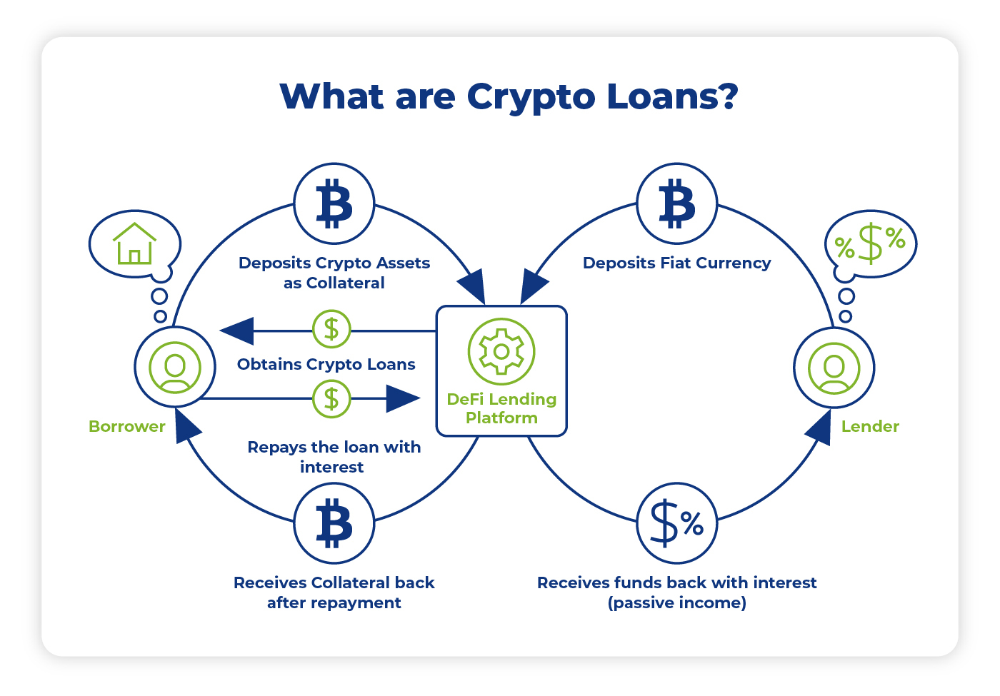

## Loans

DeFi loans are a category of DeFi applications that enable users to borrow and lend cryptocurrency without the need for a traditional financial intermediary, such as a bank.

In a DeFi loan, the borrower typically provides collateral in the form of cryptocurrency, which is held in a smart contract until the loan is repaid. The amount of collateral required varies depending on the platform and the type of cryptocurrency being used. Once the collateral is provided, the borrower can receive the loan in the form of another cryptocurrency, such as stablecoins.

DeFi loans offer several benefits over traditional loans. For borrowers, DeFi loans can provide fast, low-cost access to capital without the need for a credit check or other intermediaries. For lenders, DeFi loans offer the potential for high yields and the ability to earn interest on their cryptocurrency holdings.

Overall, DeFi loan platforms use algorithms and protocols to match lenders and borrowers, set interest rates, and manage risks.

### Types of DeFi loans

1. **Collateralized loans:** These are loans where the borrower provides collateral in the form of cryptocurrency. The amount of collateral required is typically based on the value of the loan and the volatility of the underlying cryptocurrency.
2. **Unsecured loans:** These are loans where the borrower does not provide collateral, but instead relies on their creditworthiness to secure the loan. Unsecured loans are less common in DeFi due to the high risk of default.
3. **[Flash loans](../advanced-topics-of-defi/flash-loans.md):** These are loans that are issued and repaid within a single transaction. Flash loans are typically used for arbitrage opportunities and other short-term trades.

### Typical DeFi loans protocols

- [Aave](../popular-deFi-protocols/aave.md)

### *Recommend Reading*

- [What are DeFi loans?](https://decrypt.co/resources/what-are-defi-loans-ethereum-maker-aave-explained-learn)