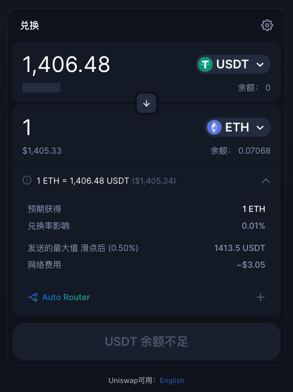
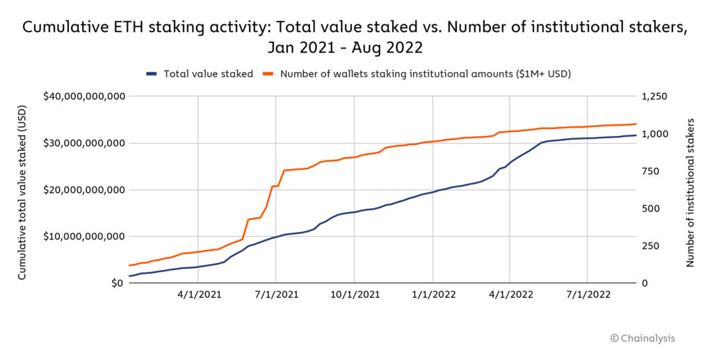

## Swapping
DeFi swapping is just a method in the decentralized finance space for transferring virtual assets. So, a DeFi token swapping is a mechanism where investors can exchange their own tokens for other ones- the definition really is as simple as that. You can swap your tokens via [Uniswap](https://app.uniswap.org/#/swap) , [1Inch](https://app.1inch.io/), [Sushiswap](https://www.sushi.com/) or other DApps.

## Staking
### What is staking?

Staking is a category of DeFi that allow cryptocurrency holders to earn rewards for holding and supporting the network of a particular blockchain. Staking involves depositing and holding a certain amount of cryptocurrency to participate in the network and to earn rewards for supporting it. By staking their tokens, users can help to secure the network and validate transactions, which in turn helps to maintain the network's integrity and security.

Staking works by requiring users to "lock up" their tokens for a specified period of time, during which the tokens are used to secure the network and earn rewards. In exchange for locking up their tokens, users can earn rewards in the form of additional cryptocurrency, which are distributed to them periodically based on their staking activity.

[Aave](https://stake.lido.fi/) is the one of protocols which provide the token staking service.

### Liquid staking

Liquid staking is a newer form of staking that allows users to stake their tokens while still being able to use them for other purposes, such as trading or providing liquidity on decentralized exchanges. Liquid staking allows users to earn staking rewards while also maintaining the flexibility to use their tokens in other DeFi applications.

Liquid staking works by allowing users to deposit their staked tokens into a smart contract that represents their ownership of the staked tokens. This smart contract then issues a "liquid" version of the staked tokens, which can be freely traded and used in other DeFi applications. The staked tokens remain locked up and are used to earn staking rewards, but the liquid version of the tokens can be used for other purposes.

[Lido](https://stake.lido.fi/) is the typical DeFi liquid staking protocol.

### Staking vs. Liquid staking

The main differences between staking and liquid staking are:

- Staking requires locking tokens in a specific network or platform, which means holders cannot freely use or trade their assets. Liquid staking does not require locking tokens, but instead provides liquidity by issuing a derivative token that is equivalent to the original token and can be redeemed at any time.
- Staking may have long unlocking periods or penalty mechanisms, which increase the cost and risk of holders exiting or transferring their assets. Liquid staking does not have these restrictions or penalties, holders can enter or exit staking pools at any time without losing any rewards or rights.
- Staking can only earn a single source of income, which is network rewards. Liquid staking can achieve yield stacking, where holders can earn network rewards as well as additional income by using their derivative tokens for other DeFi activities.

The data shows that the number of wallets staking $1 million or more worth of Ether — which we’ll refer to as institutional stakers — has been steadily increasing already.

It’ll be interesting to see if the number of institutional-sized stakers increases at a faster rate following The Merge, as this could suggest that institutional investors do indeed see Ethereum staking as a good yield-generating strategy.

## Farming

### What is farming?

Farming, also known as yield farming, is a category of DeFi applications that allow cryptocurrency holders to earn rewards by providing liquidity to decentralized exchanges (DEXs) or other DeFi platforms. Farming works by depositing cryptocurrency into a liquidity pool or smart contract, which is then used to facilitate trading on a DEX or provide liquidity to other DeFi platforms. In exchange for providing this liquidity, users can earn rewards in the form of additional cryptocurrency, which are distributed to them periodically based on their liquidity provision.

### Leverage yield Farming

Leverage yield farming is a newer form of farming that allows users to amplify their returns by borrowing additional cryptocurrency to increase the size of their farming position, and then lending the borrowed cryptocurrency to other DeFi protocols to earn additional yield. By borrowing cryptocurrency, users can increase the amount of liquidity they provide to a DEX or other DeFi platform, which in turn can result in higher rewards. By lending the borrowed cryptocurrency to other protocols, users can earn additional yield on top of the rewards from the original farming position. However, leverage yield farming also increases the risk of losses, as the borrowed cryptocurrency must be repaid with interest regardless of whether the farming position is profitable or not.

Both farming and leverage yield farming have become popular categories of DeFi applications due to their potential for high yields and the ability to earn passive income from holding cryptocurrency. However, as with all DeFi applications, it is important to be aware of the risks associated with these platforms, such as impermanent loss (where the value of the liquidity pool changes over time) and smart contract risk.

In summary, farming and leverage farming are important categories of DeFi applications that enable users to earn rewards by providing liquidity to decentralized exchanges and other DeFi platforms. These applications are important for increasing liquidity in the DeFi ecosystem and for incentivizing users to participate in these platforms. However, it is important to understand the risks associated with these applications before investing

[Alpaca Finance](https://app.alpacafinance.org/) and [Alpha Homora V2](https://homora-v2.alphaventuredao.io/) are the typical leverage yield farming protocols.

### Farming vs. Leverage yield Farming

Farming and leverage yield farming are two ways of earning passive income from DeFi protocols. Here is a brief introduction of both concepts:

- Farming is the process of staking or lending your crypto assets in a DeFi protocol in exchange for rewards in the form of interest, fees or tokens. For example, you can farm by providing liquidity to a decentralized exchange like [Uniswap](https://app.uniswap.org/#/swap) or [Sushiswap](https://www.sushi.com/) and earn a share of the trading fees and [governance tokens](../advanced-topics-of-defi/governance-tokens.md).
- Leverage yield farming is the process of borrowing more crypto assets to increase your farming position and earn higher returns. For example, you can leverage yield farm by borrowing ETH from a lending platform like Aave or Compound and use it to provide more liquidity to Uniswap or SushiSwap and earn more fees and tokens. However, leverage yield farming also involves higher risks such as liquidation, [impermanent loss](../advanced-topics-of-defi/impermanent-loss.md) and high interest rates.

### Risk

Leveraged yield farming also carries higher risks, such as liquidation risk, impermanent loss and smart contract risk.
Liquidation risk is the possibility of losing all or part of your collateral if the value of your borrowed assets exceeds your liquidation threshold.

[impermanent loss](../advanced-topics-of-defi/impermanent-loss.md) is the difference between holding tokens in a liquidity pool and holding them in your wallet. It occurs when the price ratio of tokens in the pool changes compared to when you deposited them1. Smart contract risk is the possibility of losing funds due to bugs, exploits or malicious attacks on the code that governs the platform or protocol

### *Recommend Reading*

- [How Liquid Staking Will Bridge the Gap Between DeFi and Staking](https://www.nasdaq.com/articles/how-liquid-staking-will-bridge-the-gap-between-defi-and-staking)
- [Staking Vs Yield Farming Vs Liquidity Mining- What’s The Difference?](https://www.blockchain-council.org/defi/staking-vs-yield-farming-vs-liquidity-mining/)
- [Liquid Staking Replaces DeFi Lending as Second-Largest Crypto Sector](https://www.coindesk.com/markets/2023/02/27/liquid-staking-replaces-defi-lending-as-second-largest-crypto-sector/)
- [DeFi, staking and yield farming explained in simple terms](https://pchojecki.medium.com/defi-staking-and-yield-farming-explained-in-simple-terms-e7be73284f2a)
- [Crypto Day Trading: Leveraged Yield Farming Strategies](https://thedefiant.io/leveraged-yield-farming-strategies)
- [Leveraged Yield Farming: Everything You Need to Know](https://defipedia.com/blog/leveraged-yield-farming-everything-you-need-to-know)