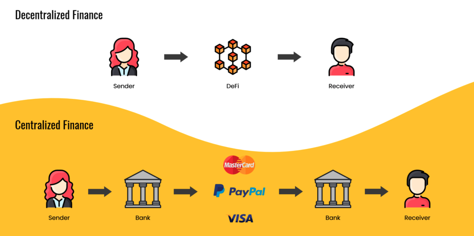

# Introduction to DeFi

## What is DeFi?

Decentralized Finance (DeFi) is a financial system built on [blockchain](../../../blockchain/README.md) technology that is designed to be open, transparent, and accessible to everyone. Unlike centralized(traditional) financial systems, which are centralized and operated by financial institutions, DeFi is decentralized and operates through a series of smart contracts on a blockchain.

DeFi protocols are designed to provide a range of financial services to users without the need for intermediaries, such as lending, borrowing, staking, swapping, farming, leverage farming and insurance, etc. 

With its open, decentralized architecture, DeFi is poised to become a key driver of the blockchain revolution, enabling the creation of new financial products and services that were previously unimaginable.

## DeFi vs. centralized finance

## How does DeFi work?

DeFi is built on blockchain technology, which is a distributed ledger that allows for the creation of decentralized applications ([DApps](../../../dapp/what-is-dapp.md)) and [Smart contracts](../../../smart-contract/patterns-&-best-practices.md). Smart contracts are self-executing programs that run on the blockchain, and can be used to automate a wide range of financial [transactions](../../../ethereum/concepts/transaction.md).

Most DeFi protocols are a type of DApp that are designed to provide financial services which are typically open-source and community-driven, meaning that anyone can contribute to their development and improvement.

When a user interacts with a DeFi protocol, they do so by connecting their blockchain [wallet](../../../blockchain/README.md) to the protocol using a Web3 browser extension or another type of interface. The user can then perform a variety of actions on the protocol, such as depositing funds, borrowing assets, or trading tokens.

All transactions on a DeFi protocol are recorded on the blockchain, providing a high degree of transparency and security. The smart contracts that power these protocols also ensure that all transactions are executed automatically and without the need for intermediaries.

## Benefits of DeFi

- [Benefits of DeFi](./benefits-of-defi.md)

## Risks of DeFi

- [Risks of DeFi](./risks-of-defi.md)

### *Recommend Reading*

- [Decentralized Finance vs Traditional Finance: What You Need To Know (Stably)](https://medium.com/stably-blog/decentralized-finance-vs-traditional-finance-what-you-need-to-know-3b57aed7a0c2)
- [Decentralized Finance: An Emerging Alternative to the Global Financial System (Frank Cardona)](https://www.visualcapitalist.com/decentralized-finance/)
- [A beginner’s guide to DeFi (Linda J. Xie)](https://nakamoto.com/beginners-guide-to-defi/)
- [Decentralized Finance Explained (Yos Riady)](https://yos.io/2019/12/08/decentralized-finance-explained/)
- [Decentralized Finance with Tom Schmidt (Software Engineering Daily)](https://softwareengineeringdaily.com/2020/02/25/decentralized-finance-with-tom-schmidt/) 
- [DeFi #3 – 2020: The Borderless State of DeFi](https://research.binance.com/analysis/2020-borderless-state-of-defi)