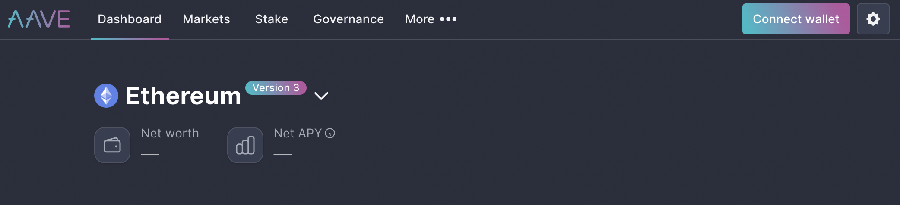

# Aave

[Aave](https://app.aave.com/) Protocol is a decentralized platform for providing crypto loans. Users can deposit cryptocurrency to earn interest or borrow cryptocurrency using their deposits as collateral. Aave also has a native token called AAVE, which can be staked to earn interest or used for governance. Some of the main functions and advantages of Aave Protocol are:

- It supports a variety of crypto assets, including stablecoins, tokens and wrapped assets.
- It offers flash loans, which are uncollateralized loans that can be taken and repaid within one transaction.
- It allows users to switch between fixed and variable interest rates depending on market conditions.
- It has a high level of security and transparency, as it is audited by third parties and governed by its community.

## Main features

Yes, there are other features in Aave that make it a unique and innovative DeFi protocol. Some of them are:

- **AAVE token**: This is the native token of Aave that can be used for governance and staking. Users can vote on proposals to improve the protocol or delegate their voting power to others. Users can also stake AAVE tokens to earn interest and secure the protocol.
- **Switching rates**: Users can choose between fixed and variable interest rates when they deposit or borrow crypto assets. Fixed rates provide more stability and predictability, while variable rates offer more flexibility and potential savings.
- **[Flash loans](../advanced-topics-of-defi/flash-loans.md)**: These are special loans that do not require any collateral and can be taken and repaid within one transaction. They can be used for arbitrage, refinancing, swapping, or other purposes. Flash loans are one of the most innovative features of Aave that enable new possibilities in DeFi.
- **Leveraged position**: Users can create a leveraged position by borrowing an asset and using it as collateral to borrow another asset. This allows users to amplify their exposure to price movements of the underlying assets.
- **Cross-chain functionality**: Aave supports multiple markets on different blockchains, such as Ethereum, Avalanche, Fantom, Harmony, and Polygon. This allows users to access different liquidity pools and benefit from lower fees and faster transactions.

## Compare with another Loan DeFi protocols

One of the main competitors of Aave is [Compound](https://compound.finance/), which is also a decentralized lending and borrowing platform. Some of the differences between Aave and Compound are:

- Aave supports more crypto assets than Compound. Aave has 30+ assets across different markets, while Compound has less assets on Ethereum.
- Aave offers flash loans, which are unique loans that do not require collateral and can be used for arbitrage or other purposes. Compound does not have this feature.
- Aave allows users to switch between fixed and variable interest rates, while Compound only has variable rates.
- Aave has a more complex user interface than Compound, which may make it harder for beginners to use. Compound has a simpler interface with fewer features.

Both Aave and Compound have their own native tokens (AAVE and COMP) that can be used for governance and earning rewards. They also have similar security measures and audits to ensure the safety of their users' funds. However, they may differ in their risk profiles, liquidity, fees, and incentives depending on market conditions and user preferences. Therefore, it is important to do your own research before using any DeFi protocol.

### *Recommend Reading*

- [Aave Document Hub](https://docs.aave.com/)
- [Aave V3 Features](https://docs.aave.com/)
- [How to Use Aave? AAVE Beginner’s Guide](https://cryptonews.com/guides/how-to-use-aave.htm)